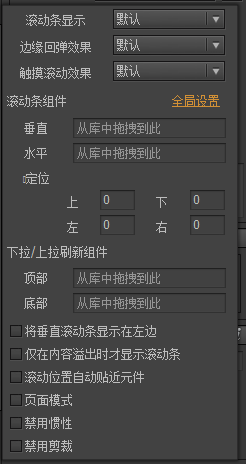
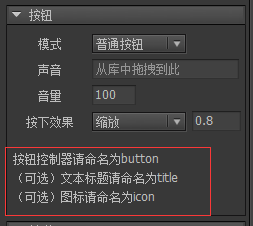
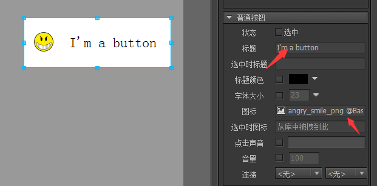

组件是FairyGUI中的一个基础容器。组件可以包含一个或多个基础显示对象，也可以包含组件。

## 组件属性

在舞台上点击**空白处**，右边属性栏显示的是容器组件的属性：


- `宽` `高` 设置组件的宽度和高度。

- `宽度限制` `高度限制` 左边为最小值，右边为最大值，0表示不限制。注意：修改宽高限制不会修改当前的宽高，即使当前的宽高值不符合限制。

- `轴心` 旋转、缩放、倾斜这些变换时的轴心点。取值范围是0~1。例如X=0.5，Y=0.5表示中心位置。点击右边的小三角形可以快速设置一些常用的值，比如中心，左下角，右下角等。

- `同时作为锚点` 勾选这个选项后，元件的原点位置将设置为轴心所在的位置。默认情况下，每个元件的(0,0)都是在左上角；勾选了轴心同时作为锚点后，则元件的(0,0)在轴心的位置。注意，关联系统是不计入这个选项的影响的，所以勾选了锚点后的元件，再使用宽高类的关联，可能表现不正常。

- `初始名字` 当组件被实例化（限编辑器内）时，自动设置组件的名称为这里设置的值。最常见的用途就是，FairyGUI里要求窗口框架组件需命名为frame，那么你创作了一个窗口框架组件后，设置“初始名字”为frame，以后每次拖入这个组件，自动就取好名字了，不用每次修改。

- `点击穿透` 默认情况下，组件的矩形区域（宽x高）将拦截点击，勾选后，点击事件可以穿透组件中**没有内容**的区域。详细说明在[点击测试](#点击测试)。

- `溢出处理` 表示处理超出组件矩形区域的内容的方式。
 - `可见` 表示超出组件矩形区域的内容保持可见，这是默认行为。
 - `隐藏` 表示超出组件矩形区域的内容不可见，相当于对组件应用了一个矩形遮罩。
 - `垂直滚动` `水平滚动` `自由滚动` 与其他UI框架很大不同，在FairyGUI中不需要拖入滚动控件实现滚动。任何一个普通的组件，只需要简单设置一个属性就可以使组件具有滚动功能。溢出处理中有三种滚动的选择，自由滚动就是横向和纵向都能滚动。详细说明在[滚动设置](#滚动设置)。

- `边缘` 设定组件四周的留空。一般用在“溢出处理”为“隐藏”或者“滚动”的情况。边缘虚化目前只有在Unity平台支持。如果组件发生了对内容的剪裁，则可以在边缘产生虚化的效果，增强用户体验。这个值应该比较大才能看出效果，例如50。

<center>

</center>

- `自定义遮罩` 详细说明在[遮罩](#遮罩)。

- `反向（挖洞）` 详细说明在[遮罩](#遮罩)。

- `像素点击测试` 详细说明在[点击测试](#点击测试)。

- `扩展` 详细说明在[扩展](#扩展)。

- `背景颜色` 设置组件编辑区域的背景颜色，仅用于辅助设计，实际组件背景都是透明的，不会有颜色。如果你需要组件有一个真实的背景色，可以放置一个图形。

- `备注` 设置组件的备注信息。这个信息目前仅供插件开发者使用，没有其他用途。

## 设计图功能


可以设定一个组件的设计图。设计图将显示在舞台上，可以设置显示在组件内容的底层或者上层。使用设计图可以使拼接UI更加快速和精准。

设计图不会发布到最终的资源中。

## 点击穿透

组件内，显示在前面的元件将优先收到点击事件。如果该元件是可触摸的，则点击事件结束，不会继续向后传递。

在组件宽度x高度的范围内点击测试都是有效的（无法穿透），无论这个范围内是否有子元件。举个例子说明。

这是组件A，大小为400x400，内容为4个白色的矩形：


这是组件B，大小为400x400，内容为一个红色的矩形：


将B先添加进舞台，然后再添加A到舞台，也就是说，A显示在B的前面，效果如下图：


可以看到，虽然A在B的上面，但红色方块是可见的，因为A在此区域并没有内容。当点击图中绿色点的位置时，点击事件将在A上面触发，而B是点击不了的。这是因为在A的范围内，点击是不能穿透的。

如果希望A能被穿透应该怎样？组件属性里提供设置：，勾选即可。代码里也可以设置：

```csharp
    //true表示不可穿透，false表示可穿透。
    aComponent.opaque = false;
```

设置穿透后，只有点击4个白块时，A才接收到点击事件，如果点击绿色点位置，B将接收到点击事件。这个特性在设计一些全屏界面时尤其要注意。例如一个主界面添加到舞台，并设置为全屏，如果不穿透的话，那么Stage.isTouchOnUI将一直返回true。

注意：图片和普通文字是不接受点击的，如果一个只含有图片或普通文字的组件，设置了点击穿透，那么整个组件就是完全穿透了，不会拦截到任何点击。

## 像素点击测试

有些特殊需求，需要用到不规则区域的点击测试。首先你要准备一张包含不规则区域的图片，图片里不透明的像素代表接受点击的区域，透明的像素代表点击穿透的区域，组件里超出图片范围的也是可穿透的区域。

把这张图片拖入舞台，然后在组件的“像素点击测试”属性里，选择这张图片。

<center>

</center>

## 滚动设置

设置了“溢出处理”为“水平滚动”、“垂直滚动”，“自由滚动”后，可以详细设置滚动的相关属性。点击“溢出处理”旁边的按钮。



- `滚动条显示` 滚动条的显示策略。 
 - `默认` 使用全局设置，在主菜单“文件”->“项目属性”->“预览设置”里设置。
 - `可见` 表示滚动条一直显示。
 - `滚动时显示` 表示滚动条只有在滚动时才会显示，其他情况下自动隐藏。
 - `隐藏` 表示滚动条一直不可见的状态。

- `边缘回弹效果` 滚动到达边缘时是否允许继续滑动/拖动一定距离，表现一个回弹的效果。一般在移动平台上使用，PC上较少。有些开发者会提出为什么我的滚动容器里内容没超出视口，却依然能滚动，这其实是边缘回弹效果。

- `触摸滚动效果` 是否允许用户直接拖拽滚动区域内的内容。一般在移动平台上使用，PC上较少，PC上一般需要拖动滚动条，或使用鼠标滚轮。

- `滚动条组件` 设置滚动条资源。一般不需要设置，全局有一个设置，在主菜单“文件”->“项目属性”->“预览设置”里。如果你要使用不同于全局设置的滚动条资源，那么在这里设置。

- `定位` 可以设置滚动条在容器中的位置，这是一个相对于正常位置的偏移值。

- `下拉/上拉刷新组件` 设置上拉刷新或下拉刷新时需要显示的组件。下面是下拉刷新的效果：

<center>

</center>

- `将垂直滚动条显示在左边` 设置垂直滚动条显示在容器的左边，而不是在容器的右边。

- `仅在内容溢出时才显示滚动条` 只有当容器内的内容超出视口区域时，才显示滚动条，否则隐藏。注意：即使是不显示，滚动条还是有预留的占位的，这个和“滚动条显示”设置为“隐藏”不相同，后者是完全取消滚动条的占位的。

- `滚动位置自动贴近元件` 在滚动结束后，保证滚动位置刚好处于任意元件的上边缘（或左边缘）。

- `页面模式` 以视口大小为页面大小，每次滚动的距离是一页。一般在移动平台上使用，PC上较少，拖动滚动条进行滚动操作与这个模式冲突。

- `禁用惯性` 当用手拖拽内容一段距离，并释放手指后，系统会根据手指移动的速度计算出一个速率，然后滚动会按照将此速率衰减到零的方式慢慢停下来，这称为惯性滚动。如果不需要此特性，可以关闭。这个功能是和“触摸滚动效果”配合使用的。

- `禁用剪裁` 一般情况下，容器会对超出视口的内容进行剪裁。特殊情况下，例如，如果一个列表的item组件自身就是滚动容器，那么item组件可以关闭剪裁。因为大量的剪裁会消耗很多的系统性能。

## 遮罩

FairyGUI的遮罩有两种：矩形遮罩和自定义遮罩。

### 矩形遮罩

将组件的“溢出处理”设置为“隐藏”或者“滚动”，那么组件就带了矩形遮罩。超出组件(矩形区域-边缘留空）的区域都不可见。无论在什么平台，这种遮罩的效率是最高的。

### 自定义遮罩

可以设置组件内一个图片或者图形作为组件的遮罩。这种遮罩一般都是使用模板测试(Stencil Op)技术。各个平台支持的力度不同：

- `AS3/Starling/Egret/Laya` 使用图形（Graph）作为遮罩时，有图形的区域内容**可见**，例如，一个圆形，则圆形区域内可见，其他区域不可见。

不能使用图片（Image）作为遮罩，因为使用图片作为遮罩也是取其矩形区域而已，用一个矩形（Graph）的图形效果是一样的。

Starling版本要使用自定义遮罩必须在应用程序描述文件里加上

```csharp
    <initialWindow>
        <depthAndStencil>true</depthAndStencil>
    </initialWindow>
```

- `Unity` 使用图形（Graph）作为遮罩时，有图形的区域内容**可见**，例如，一个圆形，则圆形区域内**可见**，其他区域不可见。

使用图片（Image）作为遮罩时，图片内透明度为0的像素对应区域的内容**不可见**，反之可见。超出图片区域的内容**不可见**。

### 反向遮罩（挖洞）

效果和正常遮罩相反，也就是可见的区域变不可见，不可见的区域变可见。目前仅Unity平台支持，例如：


使用图形（Graph）作为遮罩时，有图形的区域内容**不可见**，例如，一个圆形，则圆形区域内不可见，其他区域可见。

使用图片（Image）作为遮罩时，图片内透明度为0的像素对应区域的内容**可见**，反之不可见。超出图片区域的内容**可见**。

注意：
1. 当遮罩发生时，点击测试也同样会发生变化，只有显示出来的内容才接受点击检测，被遮住的内容不接受点击检测。
2. 对于正在编辑的组件，遮罩只有在预览时才能看到效果。
3. 定义了遮罩的组件，其内部的元件永远无法和外部的元件合并Draw Call，因为他们有不同的材质属性。

## 扩展


可以看到有六种“扩展”选择。组件可以随意在这些“扩展”中切换。选择哪种“扩展”，组件就有了那种扩展的属性和行为特性。

下面以按钮为例，介绍一下“扩展”是怎样工作的。选择“扩展”为按钮后，可以看到属性面板下方出现了按钮相关的提示和设置。



这里先忽略按钮组件的设置，后续教程会详细说明。从提示可以看到，FairyGUI中“扩展”的定义方式是以”名称约定“为基础的。一个按钮，可以带有标题和图标，这个标题（一般是一个文本）和图标（一般是一个装载器）需要你自己放置到组件中，并把他们名字设置为title和icon，就像这样：


然后我们测试一下这个刚制作好的组件。把按钮组件拖到另一个组件中，并设置一下“标题”和“图标”，如下图



效果出来了。这说明标题文本被自动设置到了名称为“title”的文本元件上，图标被自动设置到了名称为“icon”的装载器元件上。

如果按钮组件里没有放置名称为icon的装载器控件呢？那么设置图标就没有效果，仅此而已。其他约定的处理方式也相同。不会有任何报错。

从按钮的设计就可以看出FairyGUI“扩展”功能的优势所在。如果一个编辑器提供了现成的按钮组件，无论设计者考虑多么周到，都无法覆盖所有需求，就一个按钮，随便想到的变化就可能有：是否带图标/图标在左边还是右边/图标与文字的距离/是否带文字/文字的颜色/文字的大小等等。而在FairyGUI里，按钮组件内所有东西都是任由你布置的。

“扩展”还赋予了组件行为，具体到按钮上，就是处理各种鼠标或触摸事件，按下时改变状态（单选/多选），单击时播放声音等等。这些都是由“扩展”的底层去处理的。这部分同样是通过“名称约定”来工作的。例如，按钮内只要提供了名称为“button”的控制器，当鼠标悬浮在按钮上方时，就会自动切换该控制器到“over”页面；当鼠标按下时，就会自动切换该控制器到“down”页面，等等。如果按钮没有提供名称为“button”的控制器呢？上述行为就不会发生。按钮控制器并不是必须的，如果你不需要以上行为，就不用提供。

其他类型的“扩展”的工作方式与按钮类似。后续文档会详细介绍每种“扩展”的属性和行为。

## GComponent

组件支持动态创建，例如：

```csharp
    GComponent gcom = new GComponent();
    gcom.SetSize(100,100);
    GRoot.inst.AddChild(gcom);
```

动态创建的组件是空组件，可以作为其他组件的容器。一个常见的用途，如果你要建立一个多层的UI管理系统，那么空组件就是一个合适的层级容器选择。动态创建的组件默认是点击穿透的。

如果要创建UI库里的组件，应该使用这样的方式：

```csharp
    GComponent gcom = UIPackage.CreateObject("包名","组件名").asCom;
    GRoot.inst.AddChild(gcom);
```
FairyGUI和Flash/Cocos类似，采用树状的结构组织显示对象。容器可以包含一个或多个基础显示对象，也可以包含容器。这个树状结构称为显示列表。FairyGUI提供了API管理显示列表。

### 显示列表管理

- `AddChild` `AddChildAt` 向容器内添加元件。前者将元件添加到显示列表的队尾；后者可以指定一个索引控制元件的插入位置。

- `RemoveChild` `RemoveChildAt` `RemoveCihldren` 从容器内删除元件。当元件从显示对象中移出时，将不再占用显示资源。但元件从显示列表移出后，只是不显示，并没有销毁，如果你没有保存这个对象的引用留待后续使用，或者没有调用对象的Dispose方法销毁对象，那么会产生内存泄露。

- `GetChild` `GetChildAt` 通过索引或名称获得元件引用。元件的名字是允许重复的，在这种情况下，GetChild返回第一个匹配名称的对象。

- `GetChildIndex` 获得指定元件在显示列表中的索引。

- `SetChildIndex` `SwapChildren` `SwapChildrenAt` 设置元件在显示列表中的索引。

### 渲染顺序

显示对象的渲染顺序取决于它的显示列表中的顺序，顺序大的后渲染，即显示在较前面。一般来说，我们都是使用AddChild或SetChildIndex调整渲染顺序。例如如果要一个元件显示在容器的最前面，那调用AddChild(元件)就可以了，AddChild是可以重复调用的。也可以调用SetChildIndex设置对象在显示列表中的具体位置，例如SetChildIndex(元件,0)就可以将元件置于最底层。

还有另外一个因子可以影响渲染循序，它就是GObject.sortingOrder。**这个属性只用于特定的用途，不作常规的使用。它一般用于类似固定置顶的功能，另外，永远不要将sortingOrder用在列表中。**。sortingOrder越大，则渲染顺序越后，即显示到更前面的位置。一般情况下，sortingOrder为0，这时渲染顺序由显示对象在显示列表中的顺序决定。sortingOrder可以令你更灵活的控制渲染循序。例如，如果希望一个元件始终保持在其他元件上方，可以设置其sortingOrder一个较大的整数值，这样无论容器使用AddChild添加了多少元件，这个元件依然显示在最前面。（sortingOrder的效率较差，勿做频繁调用的用途）

上面提到的都是调整对象在显示列表中的顺序，如果不想调整这个顺序的同时，又要调整渲染顺序，组件还提供了另一种方式。

```csharp
    //升序，这是默认值，按照对象在显示列表中的顺序，从小到大依次渲染，效果就是序号大的显示在较前面。
    aComponent.childrenRenderOrder = ChildrenRenderOrder.Ascent;

    //降序，按照对象在显示列表中的顺序，从大到小依次渲染，效果就是序号小的显示在较前面。
    aComponent.childrenRenderOrder = ChildrenRenderOrder.Descent;

    //拱形，需要指定一个顶峰的索引，从两端向这个索引位置依次渲染，效果就是这个位置的对象显示在最前面，两边的对象依次显示在后面。
    aComponent.childrenRenderOrder = ChildrenRenderOrder.Arch;
    aComponent.apexIndex = 3; //索引为3的对象显示在最前面。
```

### 绑定扩展类

可以绑定一个类为组件的扩展类。首先，编写一个扩展类：

```csharp
    public class MyComponent : GComponent
    {
        GObject msgObj;

        //如果你有需要访问容器内容的初始化工作，必须在这个方法里，而不是在构造函数里。
        override protected void ConstructFromXML(XML xml)
        {
            base.ConstructFromXML(xml);
            
            //在这里继续你的初始化
            msgObj = GetChild("msg");
        }

        public void ShowMessage(string msg)
        {
            msgObj.text = msg;
        }
    }
```

然后注册你的扩展类。注意，**必须在组件构建前注册**。

```csharp
    UIObjectFactory.SetPackageItemExtension("ui://包名/组件A”, typeof(MyComponent));
```

这样就为组件A绑定了一个实现类MyComponent 。以后所有组件A创建出来的对象（包括在编辑器里使用的组件A）都是MyComponent类型。然后我们就可以为MyComponent添加API，用更加面向对象的方式操作组件A。例如：

```csharp
    MyComponent gcom = (MyComponent)UIPackage.CreateObject(“包名“， ”组件A”);
    gcom.ShowMessage("Hello world");
```

注意：如果组件A只是一个普通的组件，没有定义“扩展”，那么基类是GComponent，如上例所示；如果组件A的扩展是按钮，那么MyComponent的基类应该为GButton，如果扩展是进度条，那么基类应该为GProgressBar，等等。这个千万不能弄错，否则会出现报错。

## ScrollPane

当组件的“溢出处理”设置为“滚动”后，可以通过GComponent.scrollPane使用滚动相关的功能，例如：

```csharp
    ScrollPane scrollPane =  aComponent.scrollPane;
    //设置滚动位置为100像素
    scrollPane.posX = 100;

    //滚动到中间位置，带动画过程
    scrollPane.SetPercX(0.5f, true);
```

当你增删子组件后，或者移动子组件的位置、调整子组件的大小，容器是自动更新滚动区域的，不需要调用任何API。这个刷新发生在本帧绘制之前。如果你希望立刻访问子元件的正确坐标，那么可以调用`EnsureBoundsCorrect`通知GComponent立刻重排。EnsureBoundsCorrect是一个友好的函数，你不用担心重复调用会有额外性能消耗。

ScrollPane中常用的API有：

- `viewWidth` `viewHeight` 视口宽度和高度。

- `contentWidth` `contentHeight` 内容高度和宽度。

- `percX` `percY` `SetPercX` `SetPercY` 获得或设置滚动的位置，以百分比来计算，取值范围是0-1。如果希望滚动条从当前值到设置值有一个动态变化的过程，可以使用Set方法，它们提供了一个是否使用缓动的参数。

- `posX` `posY` `SetPosX` `SetPosY` 获得或设置滚动的位置，以绝对像素值来计算。取值范围是0-最大滚动距离。垂直最大滚动距离=（内容高度-视口高度），水平最大滚动距离=（内容宽度-视口宽度）。如果希望滚动条从当前值到设置值有一个动态变化的过程，可以使用Set方法，它们提供了一个是否使用缓动的参数。

- `ScrollLeft` `ScrollRight` `ScrollUp` `ScrollDown` 向指定方向滚动N*`scrollStep`。例如，如果scrollStep=20，那么ScrollLeft(1)表示向左滚动20像素，ScrollLeft(2)表示向左滚动40像素。注意：如果滚动属性设置了贴近元件，例如元件大小为41像素，则需要滚动距离超过20像素，才能真正发生滚动，那么如果调用ScrollLeft(1)，在scrollStep=20的情况下，会导致看不到任何效果。

- `ScrollToView` 调整滚动位置，使指定的元件出现在视口内。

可以侦听滚动改变，在任何情况下滚动位置改变都会触发这个事件。

```csharp
    //Unity
    scrollPane.onScroll.Add(onScroll);

    //AS3
    scrollPane.addEventListener(Event.SCROLL, onScroll);

    //Egret
    scrollPane.addEventListener(ScrollPane.SCROLL, this.onScroll, this);

    //Laya，注意是用组件侦听，不是ScrollPane
    aComponent.on(fairygui.Events.SCROLL, this, this.onScroll);
```

和滚动相关的事件还有：

- `ScrollEnd` 惯性滚动结束后回调。
- `PullDownRelease` 下拉刷新回调。
- `PullUpRelease` 上拉刷新回调。

```csharp
    //Unity
    scrollPane.onScrollEnd.Add(onScrollEnd);
    scrollPane.onPullDownRelease.Add(onPullDownRelease);
    scrollPane.onPullUpRelease.Add(onPullUpRelease);

    //AS3
    scrollPane.addEventListener(ScrollPane.SCROLL_END, onScrollEnd);
    scrollPane.addEventListener(ScrollPane.PULL_DOWN_RELEASE, onPullDownRelease);
    scrollPane.addEventListener(ScrollPane.PULL_UP_RELEASE, onPullUpRelease);

    //Egret
    scrollPane.addEventListener(ScrollPane.SCROLL_END, this.onScrollEnd, this);
    scrollPane.addEventListener(ScrollPane.PULL_DOWN_RELEASE, this.onPullDownRelease, this);
    scrollPane.addEventListener(ScrollPane.PULL_UP_RELEASE, this.onPullUpRelease, this);

    //Laya，注意是用组件侦听，不是ScrollPane
    aComponent.on(fairygui.Events.SCROLL_END, this, this.onScrollEnd);  
    aComponent.on(fairygui.Events.PULL_DOWN_RELEASE, this, this.onPullDownRelease);  
    aComponent.on(fairygui.Events.PULL_UP_RELEASE, this, this.onPullUpRelease);    
```