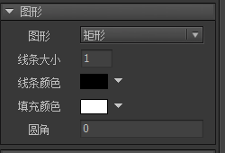

FairyGUI支持生成简单的图形。 点击侧工具栏的按钮生成一个图形。

## 实例属性



- `图形` 选择形状为矩形、圆形或者“无”。“无”表示这是一个空的图形，他不消耗任何显示资源，通常用作一个占位的用途。详细可见下面的介绍。*（部分SDK不支持圆形）*

- `线条大小` 形状的描边大小。0则表示不描边。*（Unity/Starling版本目前不支持圆形的描边）*

- `线条颜色` 形状的描边颜色。

- `填充颜色` 形状的填充颜色。如果你希望绘制中空的图形，那把填充颜色的透明度设置为0即可。

- `圆角` 一个整数或者4个用逗号分隔的整数。例如“4”，表示矩形的四个角均为半径为4的圆角。例如“2,1,1,4”，则指定了每个角的半径。*Unity、Starling版本不支持圆角的设置，如果你仍然希望使用圆角矩形，可以在右键菜单里点击“转换为位图”*

## GGraph

图形支持动态创建，动态创建图形需要注意一定要设置图形的大小，否则显示不出来。例如：

```csharp
    GGraph holder = new GGraph();
    holder.SetSize(100, 100);
    holder.DrawRect(...);
    aComponent.AddChild(holder);
```

前面提到，空白的图形可以用作一个占位的用途，运行中可能用其他对象替换这个空白图形。FairyGUI的显示对象与原生显示对象混合使用时就需要用到这种空白的图形。

举例：现在要在UI中放置入一个原生的对象aSprite，则可以在适当位置放入一个空白的图形，假设对象为holder，那么代码里可以这样写：

```csharp
    holder.SetNativeObject(aSprite);
```

这样就把aSprite放到了holder所在的位置和深度上。 通过这样的办法，任何原生显示对象都可以轻松插入到FairyGUI的显示列表中。

如果SetNativeObject被重复调用，则前一个设置对象被销毁，插入新的对象。

通过GGraph.shape属性可以获得原生矢量绘制的接口类。特别说明的是，Unity平台没有矢量绘制引擎，因此目前只提供了绘制矩形、圆形和多边形。以下是Unity里运用GGraph对象的一些技巧：

```csharp
    //传入多边形的各个顶点绘制多边形
    aGraph.shape.DrawPolygon(new Vector2[] { ...} }, new Color[] { ... };

    //绘制一个渐变色的矩形
    aGraph.shape.DrawRect(0, new Color[] { ... });
```

再次提醒，如果图形是动态创建的，记得设置图形的大小。