## 打开项目和创建项目

启动FairyGUI编辑器后，首先显示的是打开项目/创建项目的窗口：

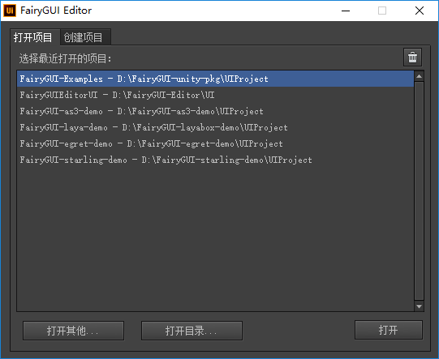

- `历史记录` 曾经打开过的项目可以直接从列表中点击打开。
- `删除` 点击右上的垃圾桶按钮删除选定的打开历史记录。
- `打开其他` 通过选择一个项目描述文件 xxx.fairy 打开一个已有项目。
- `打开目录` 通过选择项目所在的目录打开一个已有项目。适用于打开2.x版本的项目。

编辑器支持同时打开多个项目。Windows平台下，可以直接启动多个FairyGUI编辑器。Mac平台下，你可以在打开一个项目后，再点击菜单“文件”->“在新窗口打开项目”打开其他项目。

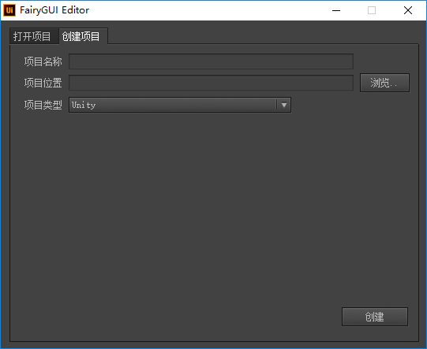

在指定位置创建一个新的UI项目。

- `项目名称` 任意的项目名称。
- `项目类型` UI项目类型，即目标平台。不同的平台类型在资源组织、发布上有一定的差别。不需要担心这里选择错了项目类型，在项目创建后可以随时调整UI项目类型，操作位置在菜单“文件”->“项目属性”里。

## 资源管理

FairyGUI的项目在文件系统的结构为：


- FairyGUI是以包为单位组织资源的。包在文件系统中体现为一个目录。assets目录下每个目录都是一个包。包内的每个资源都有一个是否导出的属性，一个包只能使用其他包设置为已导出的资源，而不设置为导出的资源是不可访问的。同时，只有设置为导出的组件才可以使用代码动态创建。

- 包发布后可以得到一个描述文件和一张或多张纹理集（不同平台的文件数量和打包方式可能有差别）。FairyGUI是不处理包之间的依赖关系的，如果B包导出了一个元件B1，而A包的A1元件使用了元件B1，那么在创建A1之前，必须保证B包已经被载入，否则A1里的B1不能正确显示（但不会影响程序正常运行）。这个载入需要由开发者手动调用，FairyGUI不会自动载入。

- 如何划分包，有一个原则，就是不要建立交叉的引用关系。例如避免A包使用B包的资源，B包使用C包的资源这类情况。我们一般都建立一个或多个公共包，把整个项目需要频繁使用到的资源放在这里，把一些基础组件，例如按钮、滚动条、窗口背景等也放到这里。其他包需要使用时直接从公共包拖入就可以了。除了公共包，其他包相互之间尽量不发生引用关系。简洁的依赖关系可以使程序员更轻松地控制UI资源的载入和卸载。

- 包划分的粒度一般没有一个硬性的规定。在具体实践中，有不同的方案，比如有的人喜欢分的比较细，一个模块一个包；有的人喜欢包少一点，就把不同UI模块的资源和组件都堆在一起。这些方案对UI的运行性能影响都不大。但是图片资源尽量不要太分散，因为不同包的图片是不能打在同一张纹理集上的，如果资源太分散，可能造成纹理集的留空过多，浪费空间。

**增删改资源**

你可以直接在文件管理器（或Finder）进行这些操作：

- `增加资源` 可以直接将素材放置到包目录里。也可以将另外项目的包直接拷入到assets目录。然后点击库面板上面的刷新按钮。

- `移动资源` 可以将素材在包内各个文件夹里移动。但不能跨包移动，否则引用关系将丢失。然后点击库面板上面的刷新按钮。

- `删除资源` 可以直接在包目录里删除素材；然后点击库面板上面的刷新按钮。

- `替换资源` 可以用外部工具打开素材编辑，也可以直接替换文件。这类操作无需刷新，返回到编辑器就可以看到最新修改的结果。

**package.xml**

每个包里都有一个package.xml文件，这个是包的数据库文件，如果这个文件被破坏，那么包的内容将无法读取。在多人协作的情况下，如果package.xml出现冲突，请谨慎处理。

## 库面板

进入编辑器后，主界面的左边是库面板。库面板包括资源库和收藏夹两个子面板。

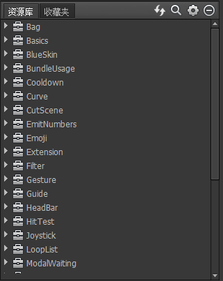

库面板里采用树状结构显示。顶层节点是包，每个包下面可以创建文件夹。可以直接在键盘上按包名第一个字符的拼音的首字母，直接定位包。

可以直接将图片、声音、动画、文字等素材从文件管理器（或Finder）中拖动到资源库中。素材在同一个包中可以在各个文件夹中移动，也可以使用复制和粘贴功能。如果要更新素材，可以点击资源，在右键菜单中选择“更新资源”，也可以在文件管理器（或Finder）中直接替换文件，后者适合批量操作。

如果拖入图片显示不正确，请检查图片的位深度是否32bit（右键，属性），目前不支持位深度为32bit的图片。

**资源URL地址**

在FairyGUI中，每一个资源都有一个URL地址。选中一个资源，右键菜单，选择“复制URL”，就可以得到资源的URL地址。无论在编辑器中还是在代码里，都可以通过这个URL引用资源。例如设置一个按钮的图标，你可以直接从库中拖入，也可以手工粘贴这个URL地址。这个URL是一串编码，并不可读，在开发中使用会造成阅读困难，所以我们通常使用另外一种格式：ui://包名/资源名。两种URL格式是通用的，一种不可读，但不受包或资源重命名的影响；另一种则可读性较高。

**资源导出**

包内的每个资源都有一个是否导出的属性，已导出的资源的图标右下角有一个小红点。使用右键菜单提供的功能可以方便的切换一个或多个资源的导出属性。

**收藏夹**

收藏夹提供了一个快速访问常用组件的功能。可以将一些常用的组件或素材放置在收藏夹里，便于快速访问。也可以实现一个类似控件面板的功能。在资源库里右键单击一个或多个资源，然后在右键菜单中选择“加入收藏夹”，就可以将资源加入收藏夹。

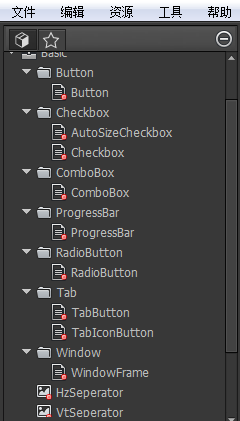

**过滤显示包**

当库面板里的包比较多时，查找东西比较麻烦。可以把一些不常用的包隐藏起来。点击库面板上的

**快速定位**

**复制、粘贴和粘贴全部**

库里面的资源可以复制粘贴。使用右键菜单中的“复制” “粘贴” “粘贴全部”或者“Ctrl+C” “Ctrl+V”都可以完成。

“粘贴”和“粘贴全部”在跨包复制时体现区别。
- `粘贴全部` 把选定的资源以及它（们）所有引用到的资源一并粘贴过来。
- `粘贴` 只会粘贴选定的资源以及它（们）引用到但**没有设置为导出**的资源。快捷键为Ctrl+V。

提示：复制、粘贴功能支持跨项目，同时打开两个项目后，就可以互相复制粘贴。

## 主工具栏


- `屏蔽显示控制器` 屏蔽后所有被显示控制器隐藏的内容都会显示出来。
- `屏蔽关联系统` 屏蔽后手动修改元件坐标和大小关联系统不会动作。
- `提醒信息` 如果当前文档内有同名对象，会显示黄色叹号。
- `在库中显示` 点击可在库中定位这个组件。

## 侧工具栏

 可以在拖动和选择两种模式间切换。特别的，在选择模式下，按住空格就可以临时切换为拖动模式，释放空格就可以切换为选择模式。

 基础控件区域。点击后再在舞台上点击一个位置，则在对应位置生成一个对象。

 组合和取消组合。组合的快捷键是Ctrl+G，取消组合的快捷键是Ctrl+Shift+G。

 对齐操作。选定多个元件后，再点击这里的按钮，可以执行对应的对齐功能。例如选定两个元件后，点击左右居中，则两个元件将设置为中线对齐。如果只选择了一个元件，则该元件对容器组件执行对应的对齐功能。例如，选定一个元件后，点击左右对齐，则元件将移到容器组件的中间位置。又例如，选定一个元件后，点击相同宽度，则元件的宽度将设置为与容器组件相同。

 自定义排列。点击后弹出自定义排列的对话框。

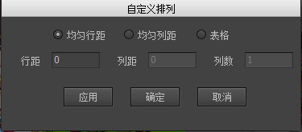

## 控制器工具栏

 

点击加号可以增加新的控制器。点击控制器名称可以进入控制器编辑界面。点击控制器的各个页面按钮切换页面。

## 动效工具栏

 

点击加号可以增加新的动效。点击动效名称可以进入动效编辑界面。

## 显示列表

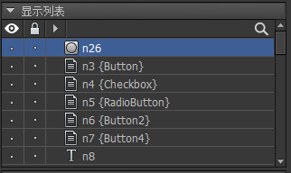

这里显示的当前正在编辑的组件的显示列表。按显示顺序排列，列表中越往下的元件显示在越前面。
显示列表面板的操作有：
- 点击每行行头“眼睛”对应的位置可以隐藏元件，仅用于辅助编辑，不影响运行时。
- 点击每行行头“锁”对应的位置可以锁定元件，锁定后元件无法选中，仅用于辅助编辑，不影响运行时。
- 点击锁图标可以解锁所有元件。
- 点击眼睛图标可以解除所有元件的隐藏状态。
- 在显示列表中拖拽可以改变元件在显示列表中的位置。

## 舞台


舞台是组件的编辑区域。添加内容到舞台的方法有：

- 侧工具栏上点击基础控件，然后点击舞台。
- 从资源库或收藏夹中直接拖拽资源到编辑区域。
- 可直接粘贴剪贴板中的文字或图片。图片会自动导入到资源库，然后再放置到舞台上。
- 可以从Windows资源管理器或者Finder中直接拖入资源。如果该资源是位于assets目录下的，也就是说已经是包里的资源里，那么对应包里的资源会放置到舞台上，不会发生资源重复导入到资源库的情况。这个设计可以部分解决目前库面板不能显示所有图片缩略图的不便利性，因为在Windows资源管理器或者Finder中你可以方便的查看缩略图，同时，如果你是使用多屏工作，还可以起到类似将库面板放置单独一屏的作用。

中间不同于周边颜色的是组件区域。但你并不需要把所有内容都放置到组件区域内。默认情况下，超出组件区域的内容依然会被显示，但组件的大小仅由组件区域决定。某些特别的功能，例如滤镜，只对组件区域生效，所以建议把内容都放置在组件区域内。

常用的舞台操作有：

- `选定` 点击一个元件单选，按住SHIFT点击多个元件多选。点击空白处取消所有选择。在空白处按下并拖动进行框选。

- `移动` 按住元件拖动，如果拖动时按住SHIFT，则移动限制在垂直方向或者水平方向。使用键盘上、下、左、右箭头键可以移动选定的元件，每按一次移动1像素，如果同时按下SHIFT键，则移动加速，每次移动10像素。

- `缩放` 拖拽选定框边缘的9个调整点，可以改变元件的宽度和高度。

- `组合` 选定多个元件后，按CTRL+G建立一个组合。

**舞台右键菜单**


- `交换元件` 可以将当前选中的元件替换成另外一个元件，位置大小等所有属性都会保留。

- `转换为组件` 可以将当前选中的一个或多个元件替换成一个单独的组件，这个组件的内容包括原来选择的内容。

- `转换为位图` 可以将当前选中的一个或多个元件替换成一个单独的图片，这个图片的内容由原来选中的内容绘制而成。生成的图片自动加入资源库中。

- `在库中显示` 在库中高亮显示当前选中的元件。

## 预览

点击主工具栏上的按钮可以进入预览模式。


**适配测试**


如果当前设计的组件需要进行适配测试，可以勾选“适配测试”选项。勾选后，如果是第一次测试，需要先点击“整体缩放”按钮，设置好UI自适应的参数。然后再调整本组件的自适应参数进行测试。
注意：如果你在动效播放的过程中改变屏幕大小，而这个动效有涉及到带适配设置的元件，那么动效可能播放异常。所有请不要在动效播放的过程中改变屏幕大小。

## 属性面板

点击舞台中任意一个或多个元件，编辑器右侧将显示对应的属性设置面板。如果你点击舞台的空白处（不点中任何东西），则显示的是容器组件的属性面板。

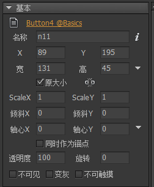

后续讲解各个资源类型使用方法时再详细介绍这里的属性含义。

## 项目设置对话框

打开项目设置对话框：主菜单“文件”->“项目设置”

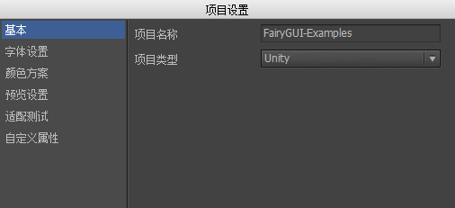

这里可以修改项目的名称和类型。

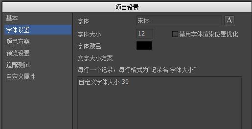

修改文本相关的一些全局设置。

- `字体` 设置所有文本的默认字体。可以点击“A”按钮选择系统中其他字体。如果你需要使用ttf文件，请先双击ttf文件，将字体安装到系统，再在这里选择（需要重启编辑器才能看到）。这个字体设置仅用于编辑器内，运行时具体使用什么字体，需要使用UIConfig.defaultFont设定。为了使编辑器效果与运行时效果一致，应该尽量选择相同的字体或者相近的字体。例如：

```csharp
    UIConfig.defaultFont = 'HeiTi';
```

- `文字大小方案` 一个游戏或应用中使用的字体大小通常有几种固定的方案，这里定义好后，制作UI时需要设置字体大小时，就可以直接在下拉菜单选择，而不需要每次输入。

<center>

</center>

- `禁用字体渲染位置优化` 该选项仅适用于Egret和Laya版本。勾选后，FairyGUI将使用系统渲染文本的默认位置，不再进行自动的优化。这个差别这对于微软雅黑特别明显。这个选项可以帮助解决部分H5引擎渲染字体位置的问题。

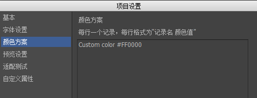

设置颜色设置的方案。一个游戏或应用中使用的颜色通常有几种方案，这里定义好后，制作UI时需要设置颜色时，就可以直接在下拉菜单选择，而不需要每次调色。


设置编辑器预览用到的一些参数。**注意这些参数仅用于编辑器内，运行时需要用UIConfig重新设置**。

- `垂直滚动条` `水平滚动条` 设置制作UI时所有带滚动功能的容器需要使用的滚动条资源。这就是说，你将一个组件或者一个列表的“溢出处理”设置为“垂直滚动”、“水平滚动”或者“自由滚动”后，不需要每次设置滚动条，自动就会使用这里设置的滚动条资源。如果某个组件需要使用和全局设置不一样的滚动条，编辑器也提供了的单独的设置。

- `滚动条显示` 滚动条的显示策略。这是全局设置，也可以在组件或者列表的滚动属性设置里单独设置。
    - `可见` 表示滚动条一直显示。
    - `滚动时显示` 表示滚动条只有在滚动时才会显示，其他情况下自动隐藏。
    - `隐藏` 表示滚动条一直不可见的状态，这种情况滚动条也不占用位置。

- `TIPS组件` 设定用于显示TIPS的组件。该组件应该扩展为标签。用法参考[这里](object.html#TIPS属性)。

- `按钮点击声音` 设定按钮的默认点击声音。设置后，所有按钮点击都会播放这个声效，除非按钮自己独立设置另外的声效。


适配测试设置。详细介绍请阅读[自适应一章](adaptation.html)。


自定义属性的设置。自定义属性仅供插件开发者使用。运行时不可访问。

## 偏好设置对话框

打开偏好设置对话框：主菜单“编辑”->“首选项”。


- `导入时自动裁剪图片到最小包围` 如果设置为裁剪，则当图片加入到项目时，自动将周围的全透明区域（透明度为0）剪除。如果设置为不裁剪，而后续又想裁剪，可以双击图片打开图片属性对话框，对话框左下部有提供裁剪的功能按钮。

- `语言` 设置编辑器的界面语言。

- `版本更新` 设置是否自动更新软件。

## 包设置对话框

打开包设置对话框：主菜单“文件”->“包设置”。

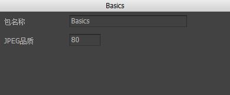

- `包名称` 查看和修改选定包的名称。

- `JPEG品质` 适用于AS3和Haxe这类不使用图集的项目。当导入JPEG图片后，会自动使用指定的品质进行压缩。其他类型的项目不压缩JPG图片。

- `压缩PNG` 适用于AS3和Haxe这类不使用图集的项目。勾选后，当导入PNG图片后，会自动将PNG图片压缩为PNG8。你也可以对图片进行单独设置是否压缩，双击图片打开图片属性对话框，调整质量选项。其他类型的项目不压缩PNG图片。

## 发布对话框

打开发布设置对话框：主菜单“文件”->“发布设置”。或点击主工具栏上的发布按钮旁边的小三角形。


左边是包列表，右边是选中包的发布设置。设置分为本包的设置和全局设置，点击右上角的黄色链接进入全局设置。全局设置作用到所有包。

- `文件名` 发布的文件名。这个文件名与包名称不同。当我们载入包时，需要使用这里设定的文件名，而当创建对象时，需要使用包名称。例如

```csharp
    UIPackage.AddPackage('file_name'); //这里是发布的文件名。
    UIPackage.CreateObject("Package1','Component1'); //这里的Package1是包的名称。
```

- `发布路径` 发布内容放置的目录。对于Unity平台，建议直接发布到Unity工程内的目录里，这样编辑器会自动根据Unity的版本给新发布的纹理提供正确的meta文件。如果不是这样，那么当你手动拷贝到Unity工程里时，请注意自行检查纹理的设置是否符合要求。
- 
- `打包方式` 可以选择打包成一个包或者两个包。两个包则将XML定义和图片等资源分开。这样做的好处是如果只修改了组件，没有加入新的素材或删除素材，则可以只发布和推送定义包给用户，减少用户的流量消耗。

- `生成代码` 生成绑定的代码。生成绑定的代码可以更直观地访问组件的各个节点，但也在一定程序度上会造成美术工作和程序员工作的耦合。

### 纹理集定义

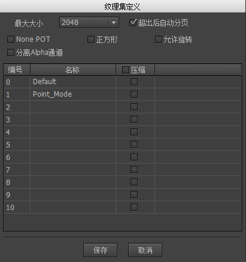

- `为Apha通道创建单独的贴图` 这个选项仅适用于Unity。通过此方法，可以在Unity里将原纹理设置为不支持Alpha通道的格式（例如ETC1）以减少内存占用。FairyGUI-unity SDK提供了专门的着色器进行混合。

- `纹理集定义` 对于支持纹理集的平台，例如Unity/Egret/Starling，你可以规划图片放到不同的纹理集内。这项功能的意义在于：
  1. 图片太大太多，假设纹理集最大支持2048×2048（这个可调整），超出此范围的你可以使用多个纹理集；
  2. 图片用途不一致，例如一张尺寸比较大的色彩丰富的背景图就不适合和色彩比较单一的UI素材放到一起，这样会使最终发布的png图片过大。将超大尺寸背景图单独放一张纹理集是一个比较好的解决方案；
  3. 图片的特性不一致，例如在Unity平台里，你可以为纹理集设置单独的Filter Mode、压缩格式等等。

- `仅发布定义` 通常发布的内容包括素材（图片、声音等）和XML定义文件， 如果你没有增删改素材，那么你可以仅发布XML定义文件，避免了重新生成图集带来的时间消耗。

### 资源排除设置

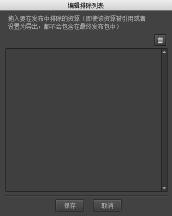

如果一些素材，只用于测试用途，例如一个装载器，放一个图片进去只用于看效果，但这个图片是不随包发布的（后续可能通过外部加载），那么可以在这个界面里将这个图片拖入，那么发布时就不会包含这个图片了。

### 发布代码设置

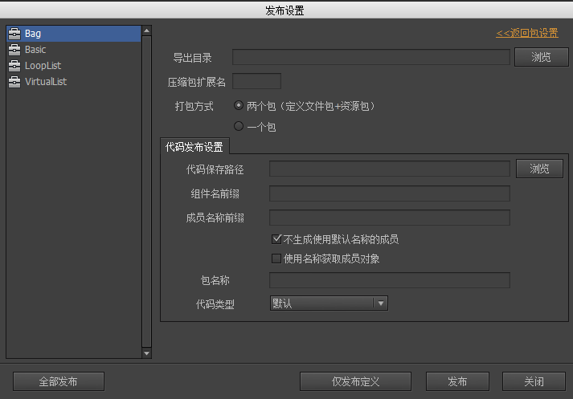

- `代码保存路径` 发布的代码保存的路径。

- `组件名前缀` 给每个组件生成的类名加上前缀。例如如果组件名为“Component1”，这里设置前缀为“T”，那么最后生成的类名为“TComponent1”。前缀可以为空。注意，如果组件名是中文，会被自动转换为拼音。

- `成员名称前缀` 给组件里每个元件的名称前加上前缀。例如如果元件名称为“n10”，这里设置前缀为“m_”，那么最后生成的类成员的名称为“m_n10”。前缀可以为空，但不建议这样做。因为元件名称很可能和类的一些属性和方法名称冲突。例如，如果元件名称为“icon”，那就和GObject的icon属性冲突了。

- `不生成使用默认名称的成员` 对于扩展组件，会有一些约定名称的元件，例如按钮里的“title”，“icon”等。这些成员已经提供了API访问，因此不需要再导出。勾选后，将忽略这些使用约定名称的元件。注意，如果一个组件里，只有约定名称的元件，而这个选项也勾选，那么整个组件都不会生成代码。例如，一个按钮，里面只有名称为“title”和“icon”的元件，则不会为这个按钮生成代码，因为使用基类GButton已经足够。

 - `使用名称获取成员对象` 如果不勾选，组件初始化时使用索引获得子对象；如果勾选，则使用名称获得子对象。前者效率高，推荐使用；后者则兼容性较好，例如，如果调整了元件的顺序，不会发生异常。

- `包名称` 对于AS3代码，是指发布的代码的package；对于C#代码，是指发布的代码的namespace；对于Typscript代码，是指发布的代码的module。

- `代码类型` 默认情况下，AS3/Starling项目发布AS3代码；Unity项目发布C#代码；Layabox/Egret发布TypeScript代码；Haxe项目发布Haxe代码。但你可以指定代码类型，例如Laybox项目发布AS3代码。

使用发布出来的代码的方式：

```csharp
    //首先要调用BindAll。发布出来的代码有个名字为XXXBinder的文件
    //注意：一定要在启动时调用。
    XXXBinder.BindAll();

    //创建UI界面。注意：不是直接new XXX。
    XXX view = XXX.CreateInstance();
    view.m_n10.text = ...;
```

发布代码时会用到代码模板。代码模板在编辑器安装目录下的template目录下。如果你需要自定义模板，需要将template目录拷贝到UI项目的根目录下，再做修改。模板里支持的参数有：

```csharp
    Component.template
    -------------
    {packageName} UI模块名
    {componentName} UI组件父类名
    {className} UI组件类名
    {uiPkgName} UI资源包名
    {uiResName}UI资源名
    {uiPath} UI资源路径
    
    Binder.template
    -------------
    {className}  UI模块名+"Binder"
    {packageName} UI模块名
```

## 依赖关系查询对话框

在资源库里，点击一个资源后，右键菜单点击“依赖关系查询”，或者在主菜单“工具”->“依赖关系查询”，可以打开依赖关系查询对话框。


在这里可以查询资源之间的依赖关系。

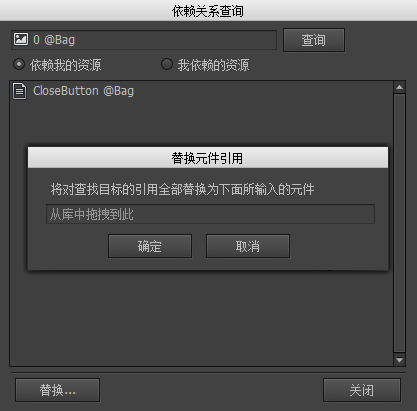

如果查询出A资源被B、C、D组件引用，那么可以将这些组件里的A替换成其他资源。

## 导入和导出资源包

- `导出资源包`

在资源库里选定一个或者多个资源，也可以选定文件夹或包，然后点击主菜单“资源”->“导出资源”：

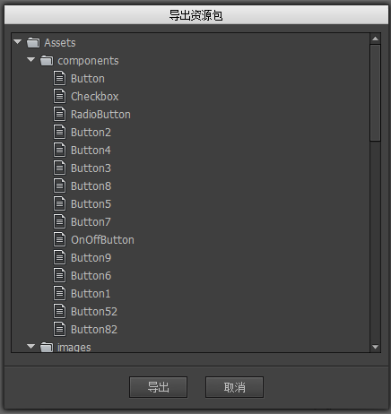

这里列出了选定的资源以及它（们）依赖的资源，点击导出，生成一个扩展名为fairypackage的文件。

- `导入资源包`

点击主菜单“资源”->“导入资源”，然后按提示选择一个扩展名为fairypackage的文件。

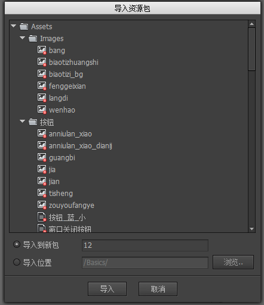

选择导入的位置，然后点击导入，fairypackage里的资源导入得到指定的位置。

- `导入内置的资源包` FairyGUI自带了几套皮肤，点击主菜单“资源”->“导入内置的资源包”，然后选择其中一个包导入即可。例如BlueSkin.fairypackage包含的内容有：


## 字符串导入和导出

使用FairyGUI编辑器可以使你的游戏支持多种语言成为一件轻松的事。

点击菜单“工具”->”字符串导入与导出”，弹出窗口如下图：

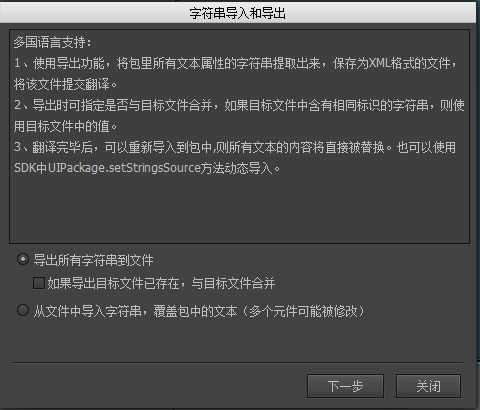

使用”导出所有字符串到文件“功能，完成后得到一个xml文件，


这个文件包含了在UI上出现的所有文字（排除了纯阿拉伯数字），然后可以将此文件提交翻译，翻译完毕后，我们有两种方式使新的语言文件生效：

“如果导出目标文件已存在，与目标文件合并”：这个选项表示，比如现在导出内容中包含1个id为x1的字符串，值为a，而目标文件也存在一个id为x1的字符串，值为b，则导出的结果文件里，x1的值为b。

- 使用上述窗口的字符串导入功能，直接将翻译好的文件导回到编辑器，则UI上的文字将全部被替换。这种方法适用于每种语言使用一个项目的方式。

- 运行时动态加载语言文件。这种方法相对比较灵活。

```csharp
    //Unity

    string fileContent; //自行载入语言文件，这里假设已载入到此变量
    FairyGUI.Utils.XML xml  = new FairyGUI.Utils.XML(fileContent);
    UIPackage.SetStringsSource(xml);
```

```csharp
    //AS3

    var fileContent:String;//自行载入语言文件，这里假设已载入到此变量
    var xml:XML = new XML(fileContent);
    UIPackage.setStringsSource(xml);
```

## 编辑器插件

点击菜单“工具”->”插件管理”，弹出窗口如下图：


这里列出了编辑器已装载的插件。
