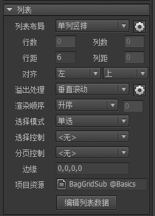
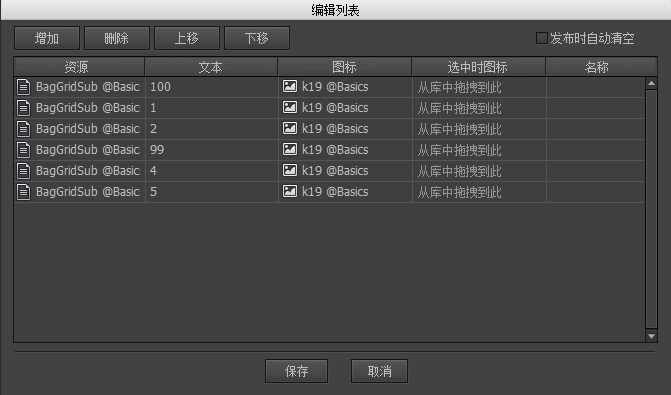

列表是组件的一种特殊扩展。点击侧工具栏的按钮生成一个列表。

## 列表属性

在舞台上点中一个列表，右边属性栏显示的是列表的属性：



- `列表布局` 目前支持的列表有五种。
 - `单列` 每行一个item，竖向排列。
 - `单行` 每列一个item，横向排列。
 - `横向流动` item横向依次排列，到底视口右侧边缘或到达指定的列数，自动换行继续排列。
 - `竖向流动` item竖向依次排列，到底视口底部边缘或到达指定的行数，返回顶部开启新的一列继续排列。
 - `分页` 视口宽度x视口高度作为单页大小，横向排列各个页面。每页中，item横向依次排列，到底视口右侧边缘或到达指定的列数，自动换行继续排列。当新的一行超出视口高度或到达指定的行数，则进入下一页。注意，分页只是列表的排列方式，不代表列表就是按页滚动。分页滚动需要在滚动属性里设置。

- `自动调整列表项目大小` 如果勾选:
 1. 列表布局为单列，则列表项目的宽度自动设置为列表显示区域的宽度；
 2. 列表布局为单行，则列表项目的高度自动设置为列表显示区域的高度；
 3. 列表布局为水平流动，且设置了列数时，则每行内的列表项目的宽度自动调整使行宽与列表显示区域的宽度相等；
 4. 列表布局为垂直流动，且设置了行数时，则每列内的项目的高度自动调整使行高与列表显示区域的高度相等；
 5. 列表布局为分页，则3、4规则均适用。

- `行数` `列数` 这个选项只对横向流动、竖向流动和分页的布局有效。如果不指定（设置为0），则一直排到边缘才换行，否则，必须每行的数量到达设定的值才换行。

- `行距` `列距` 每行/每列之间的距离。可以为负数。

- `对齐` 列表在横向和纵向上的对齐方式。注意，对齐方式的应用有前置条件。例如，如果列表是单列布局，并且设置了“自动调整列表项目大小”，那么在横向上item总是自动填满列表宽度的，那么横向上的对齐就没有作用了。

- `溢出处理` 表示超出列表矩形区域的内容的处理方式。
 - `可见` 表示超出列表矩形区域的内容保持可见。
 - `隐藏` 表示超出列表矩形区域的内容不可见，相当于对列表应用了一个矩形遮罩。
 - `垂直滚动` `水平滚动` `自由滚动` 详细说明在[滚动设置](component.html#滚动设置)。注意：列表的“布局”和“溢出处理”是独立的设置，如果两者不匹配可能达不到预期的效果。例如，对于一个单行排列的列表，如果选择“垂直滚动”，那滚动是没有效果的。

- `渲染顺序` 定义item的显示顺序与它的列表中的顺序的关系。
 - `升序` 这是默认行为。item索引越大，显示在越前面。
 - `降序` item索引越小，显示在越前面。
 - `拱形` 自定义一个显示在最前的索引，例如2，则第三个项目显示在最前面，排列在它前面的和后面的item依次显示在后面。

- `选择模式` 支持四种选择模式：无，单选，多选（使用shift键），多选（单击选择）。item要参与到单选有一个前提，是必须为单选按钮，如果不是单选按钮，则不会参与到选择模式中。单选是指同一时间只能有一个item被选中；多选则允许有多个，多选的操作方式有两种，一种是使用shift键进行多选，不过这需要键盘的支持，不适合移动设备；另一种是每个item单击即选中，再单击就取消选中的方式，不需要键盘的支持。

- `选择控制` 可以绑定一个控制器。这样当列表选中项目发生改变时，控制器也同时跳转到相同索引的页面。反之亦然，如果控制器跳转到某个页面，那么列表也同时选定相同索引的项目。

- `分页控制` 可以绑定一个控制器。当列表发生翻页滚动时（溢出处理必须为三种滚动之一，滚动必须勾选为页面模式），控制器也同时跳转到相同索引（页码）的页面。反之亦然，如果控制器跳转到某个页面，那么列表也同时滚动到相同索引（页码）的页面。

- `边缘` 设定列表四周的留空。一般用在“溢出处理”为“隐藏”或者“滚动”的情况。`边缘虚化`目前只有在Unity平台支持。如果列表发生了对内容的剪裁，则可以在边缘产生虚化的效果，增强用户体验。这个值应该比较大才能看出效果，例如50。

- `项目资源` 这里设置列表默认使用的item类型。但FairyGUI的列表可以支持多种资源混排，并不是只支持单一的item类型。

- `编辑列表数据` 为列表增删项目。



点击增加，将增加一个由”项目资源“指定的项目，你也可以直接从库中直接拖动一个组件到界面中。如果item是一个标签或按钮，那么可以在这里设置它的文本和图标。

## GList

**管理列表内容**

列表对应的类型是GList。在FairyGUI中，列表的本质就是一个组件，GList也是从GComponent派生来的，所以你可以用GComponent的API直接访问列表内的内容，例如可以用GetChild或者GetChildAt访问列表内的项目；也可以用AddChild添加一个item。这部分的API可以参考GComponent的[显示列表管理](component.html#GComponent)。

当你对列表增删改后，列表是自动排列和刷新的，不需要调用任何API。这个刷新发生在本帧绘制之前。刷新时将按照列表的布局调整各个子元件的坐标。如果你希望立刻访问item的正确坐标，那么可以调用`EnsureBoundsCorrect`通知GList立刻重排。EnsureBoundsCorrect是一个友好的函数，你不用担心重复调用会有额外性能消耗。

在实际应用中，列表的内容通常被频繁的更新。典型的用法就是当接收到后台数据时，将列表清空，然后再重新添加所有项目。如果每次都创建和销毁UI对象，将消耗很大的CPU和内存。因此，GList内建了对象池。

使用对象池后的显示列表管理方法：

- `AddItemFromPool` 从池里取出（如果有）或者新建一个对象，添加到列表中。如果不使用参数，则使用列表的“项目资源”的设置；也可以指定一个URL，创建指定的对象。

- `GetFromPool`从池里取出（如果有）或者新建一个对象。

- `ReturnToPool` 将对象返回池里。

- `RemoveChildToPool` 删除一个item，并将对象返回池里。

- `RemoveChildToPoolAt` 删除一个指定位置的item，并将对象返回池里。

- `RemoveChildrenToPool` 删除一个范围内的item，或者全部删除，并将删除的对象都返回池里

聪明的你应该能知道，AddItemFromPool = GetFromPool + AddChild  ， RemoveChildToPool = RemoveChild + ReturnToPool。

当应用到池时，我们就应该非常小心，一个不停增长的池那将是游戏的灾难，但如果不使用池，对游戏性能也会有影响。
以下是几种错误用法的举例：

错误示例1：

```csharp
    GObject obj = UIPackage.CreateObject(...);
    aList.AddChild(obj);
    
    aList.RemoveChildrenToPool();
```

添加对象时不使用池，但最后清除列表时却放到池里。这段代码持续运行，对象池将不断增大，可能造成内存溢出。
正确的做法：应从池中创建对象。将AddChild改成AddItemFromPool。

错误示例2：

```csharp
    for(int i=0;i<10;i++)
        aList.AddItemFromPool();

    aList.RemoveChildren();
```

这里添加了10个item，但移除时并没有保存他们的引用，也没有放回到池里，这样就造成了内存泄漏。将aList.RemoveChildren改成aList.RemoveChildrenToPool();

**使用回调函数修改列表**

当添加大量item时，除了用循环方式AddItemFromPool外，还可以使用另一种回调的方式。首先为列表定义一个回调函数，例如

```csharp
    void RenderListItem(int index, GObject obj)
    {
        GButton button = obj.asButton;
        button.title = ""+index;
    }
```

然后设置这个函数为列表的渲染函数：

```csharp
    //Unity
    aList.itemRenderer = RenderListItem;
    
    //AS3
    aList.itemRenderer = RenderListItem;
    
    //Egret
    aList.itemRenderer = RenderListItem;
    aList.callbackThisObj = this;
    
    //Laya
    aList.itemRenderer = Handler.create(this, this.RenderListItem);
```

最后直接设置列表中的项目总数，这样列表就会调整当前列表容器的对象数量，然后调用回调函数渲染item。

```csharp
    //创建100个对象，注意这里不能使用numChildren，numChildren是只读的。
    
    aList.numItems = 10;
```

如果新设置的项目数小于当前的项目数，那么多出来的item将放回池里。

使用这种方式生成的列表，如果你需要更新某个item，自行调用RenderListItem(索引，GetChildAt(索引))就可以了。

**列表自动大小**

严格来说，列表没有自动大小的功能。但GList提供了API根据item的数量设置列表大小。当你填充完列表的数据后，可以调用GList.ResizeToFit，这样列表的大小就会修改为最适合的大小，容纳指定的item数量。如果不指定item数量，则列表扩展大小至显示所有item。

**事件**

点击列表内的某一个item触发事件：

```csharp
    //Unity, EventContext.data就是当前被点击的item对象
    list.onClickItem.Add(onClickItem);
    
    //AS3, ItemEvent.itemObject就是当前被点击的对象
    list.addEventListener(ItemEvent.CLICK, onClickItem);
    
    //Egret，ItemEvent.itemObject就是当前被点击的对象
    list.addEventListener(ItemEvent.CLICK, this.onClickItem, this);
    
    //Laya, onClickItem方法的第一个参数就是当前被点击的对象
    list.on(fairygui.Events.CLICK_ITEM, this, this.onClickItem);
```

从上面的代码可以看出，事件回调里都可以方便的获得当前点击的对象。如果要获得索引，那么可以使用GetChildIndex。

## 虚拟列表

如果列表的item数量特别多时，例如几百上千，为每一条项目创建实体的显示对象将非常消耗时间和资源。FairyGUI的列表内置了虚拟机制，也就是它只为显示范围内的item创建实体对象，并通过动态设置数据的方式实现大容量列表。

启用虚拟列表有几个条件：

- 需要定义itemRenderer。
- 需要开启滚动。溢出处理不是滚动的列表不能开启虚拟。
- 需要设置好列表的“项目资源”。可以在编辑器内设置，也可以调用GList.defaultItem设置。

满足条件后可以开启列表的虚拟功能：

```csharp
    aList.SetVirtual();
```

提示：虚拟功能只能开启，不能关闭。

在虚拟列表中，显示对象和item的数量在数量上和顺序上是不一致的，item的数量可以通过numItems获得，而显示对象的数量可以由组件的API numChildren获得。

在虚拟列表中，需要注意item索引和显示对象索引的区分。通过selectedIndex获得的值是item的索引，而非显示对象的索引。AddSelection/RemoveSelection等API同样需要的是item的索引。项目索引和对象索引的转换可以通过以下两个方法完成：

```csharp
    //转换项目索引为显示对象索引。
    int childIndex = aList.ItemIndexToChildIndex(1);
    
    //转换显示对象索引为项目索引。
    int itemIndex = aList.ChildIndexToItemIndex(1);
```

使用虚拟列表时，我们很少会需要访问屏外对象。如果你确实需要获得列表中指定索引的某一个项目的显示对象，例如第500个，因为当前这个item是不在视口的，对于虚拟列表，不在视口的对象是没有对应的显示对象的，那么你需要先让列表滚动到目标位置。例如：

```csharp
    //这里要注意，因为我们要立即访问新滚动位置的对象，所以第二个参数scrollItToView不能为true，即不使用动画效果
    aList.ScrollToView(500);
    
    //转换到显示对象索引
    int index = aList.ItemIndexToChildIndex(500);
    
    //这就是你要的第500个对象
    GObject obj = aList.GetChildAt(index);
```

如果某个item需要更新，刷新虚拟列表的方式有两种：

- 使用numItems重新设置数量。
- GList.RefreshVirtualList。

**不允许使用AddChild或RemoveChild对虚拟列表增删对象。如果要清空列表，必须要通过设置numItems=0，而不是RemoveChildren。**

虚拟列表支持可变大小的item，可以通过两种方式动态改变item的大小：

- 在itemRenderer的内部使用width、height或SetSize改变item的大小。
- item建立对内部元件的关联，例如item建立了一个对内部某个可变高度文本的高高关联，这样当文本改变时，item的高度自动改变。

**除这两种方式外，不可以通过其他方式改变item大小，否则虚拟列表排列会错乱。**

虚拟列表支持不同类型的item混合。首先为列表定义一个回调函数，例如

```csharp
    //根据索引的不同，返回不同的资源URL
    string GetListItemResource(int index)
    {
        Message msg = _messages[index];
        if (msg.fromMe)
            return "ui://Emoji/chatRight";
        else
            return "ui://Emoji/chatLeft";
    }
```

然后设置这个函数为列表的item提供者：

```csharp
    //Unity
    aList.itemProvider = GetListItemResource;

    //AS3
    aList.itemProvider = GetListItemResource;

    //Egret
    aList.itemProvider = GetListItemResource;
    aList.callbackThisObj = this;

    //Laya
    aList.itemProvider = Handler.create(this, this.GetListItemResource);
```

对于横向流动、竖向流动和分页的列表，与非虚拟列表具有流动特性不同，虚拟列表每行或每列的item个数都是固定的。列表在初始化时会创建一个默认的item用于测算这个数量。
如果你仍然需要每行或每列不等item数量的排版，且必须使用虚拟化，那么可以插入一些用于占位的空组件或者空图形，并根据实际需要设置他们的宽度，从而实现那种排版效果。

## 循环列表

循环列表是指首尾相连的列表，循环列表必须是虚拟列表。启用循环列表的方法为:

```csharp
    aList.SetVirtualAndLoop()。
```

循环列表只支持单行或者单列的布局，不支持流动布局和分页布局。
循环列表的特性与虚拟列表一致，在此不再赘述。