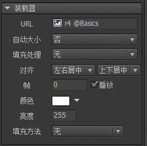

装载器的用途是动态载入图片或动画。点击主工具栏中的按钮，生成一个装载器。

## 实例属性



- `URL` URL指向的资源可以是图片或者动画。

- `自动大小` 设置装载器是否根据内容的大小自动调整自身的大小。例如，如果图片的大小是100x100，则装载器的大小自动变成100x100。

- `填充处理` 当需要显示的图片或动画与装载器大小不相同时使用的缩放策略。注意如果你设置了自动大小，那这个填充处理就无意义了。因为这个选项只是当装载器大小与内容大小不一致时的处理方式。

- `对齐` 设置装载器内容的对齐方式。

- `帧` 如果内容是动画，可以设置动画的当前帧。如果内容是图片，这个设置无意义。

- `播放` 如果内容是动画，可以设置动画是播放还是停止，如果内容是图片，这个设置无意义。

- `颜色` 修改动画各个颜色通道的值，使动画产生变色的效果。*（注：Egret、Laya版本目前是通过滤镜实现的，效率较低，不推荐使用此功能）。*

- `亮度` 调整动画的明暗。这个实际是通过修改`颜色`属性实现的，和设置颜色为灰阶颜色一样的效果。

- `填充方法` 设置填充方法可以实现图片的一些裁剪效果。详细说明请参考图片的[填充方法](image.html#实例属性)。*（注：仅Starling、Unity版本支持）*

## GLoader

装载器支持动态创建，动态创建图形一定要设置图形的大小，否则显示不出来。例如：

```csharp
    GLoader aLoader = new GLoader();
    aLoader.SetSize(100,100);
    aLoader.url = "ui://包名/图片名";
```

GLoader可以载入图片和动画，但不能是组件或其他类型的元件。如果是UI包里的资源，那么通过“ui://包名/图片名”这种格式的地址就可以载入。但实际项目中，可能我们还需要载入和显示一些不在UI包里的，我们称之为“外部”的图片。默认的GLoader具有有限度的的加载外部资源的能力，它们是：

- AS3 使用flash.display.Loader加载的外部资源。
- Starling 使用flash.display.Loader加载的位图资源。加载后转化为Texture。
- Egret 使用egret.RES.getResAsync加载的外部位图资源。
- Layabox 使用Laya.loader.load加载的外部资源。
- Unity 使用Resources.Load加载的外部贴图资源。

例如：

```csharp
    //AS3，加载一个网络图片
    aLoader.url = “http://www.fairygui.com/logo.png”;

    //Egret，这里demoRes是resources.json里定义的一个资源
    aLoader.url = “demoRes”;

    //Unity, 这里加载的是路径为Assets/Resources/demo/aimage的一个贴图
    aLoader.url = “demo/aimage”;
```

如果这些默认的外部加载机制不能满足你的需求，例如，你希望从AssetBundle中获取资源，或者你需要加入缓存机制（这是有必要的，如果需要重复加载，建议做缓存），或者需要控制素材的生命期（这也是必要的，因为GLoader不会销毁外部载入的资源），那么你需要扩展GLoader。

1. 首先编写你的Loader类，有两个重点方法需要重写：

  ```csharp
    class MyGLoader  : GLoader
    {
        override protected function LoadExternal()
        {
            /*
            开始外部载入，地址在url属性
            载入完成后调用OnExternalLoadSuccess
            载入失败调用OnExternalLoadFailed

            注意：如果是外部载入，在载入结束后，调用OnExternalLoadSuccess或OnExternalLoadFailed前，
            比较严谨的做法是先检查url属性是否已经和这个载入的内容不相符。
            如果不相符，表示loader已经被修改了。
            这种情况下应该放弃调用OnExternalLoadSuccess或OnExternalLoadFailed。
            */
        }

        override protected function FreeExternal(NTexture texture)
        {
            //释放外部载入的资源
        }
    }
  ```

2. 注册我们要使用的Loader类。注册完成后，游戏中**所有装载器**都变成由MyGLoader实例化产生。

  ```csharp
    UIObjectFactory.SetLoaderExtension(typeof(MyGLoader));
  ```

  在Unity平台中，如果在某些特殊场合需要将Texture2D对象赋予给GLoader，例如一个视频贴图，那么可以这样做：

  ```csharp
    //必须注意GLoader不管理外部对象的生命周期，不会主动销毁your_Texture2D
    aLoader.texture = new NTexture(your_Texture2D);
  ```
