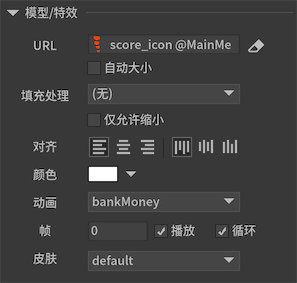

3D内容装载器的用途是动态载入比较复杂的资源，例如骨骼动画、模型（暂未支持）、粒子特效（暂未支持）等。点击主工具栏中的按钮，生成一个3D内容装载器。

## 实例属性



- `URL` URL指向的资源，目前只支持Spine动画资源或者龙骨动画资源。如果选中，则发布时会自动清空这里设置的值。

- `填充处理` 当需要显示的内容与装载器大小不相同时使用的缩放策略。
  - `无` 内容不会发生任何缩放。
  - `等比缩放（显示全部）` 按照最小比率缩放，不变形，一边可能留空白。
  - `等比缩放（无边框）` 按照最大比率缩放，不变形，一边可能超出装载器矩形范围。
  - `等比缩放（适应高度）` 内容高度占满装载器高度，宽度等比缩放。
  - `等比缩放（适应宽度）` 内容宽度占满装载器宽度，高度等比缩放。
  - `自由缩放` 内容缩放至占满装载器矩形范围，不保持比例。

  备注：**装载器没有剪裁功能，如果要剪裁超出部分，需要把装载器放入一个溢出隐藏的组件。**

- `仅允许缩小` 勾选后，在处理`填充处理`时，装载器加载的内容将永远不被放大，但可以被缩小。

- `对齐` 设置装载器内容的对齐方式。

- `颜色` 修改颜色，使装载器的内容产生变色的效果。
- 
- `动画` 如果内容是骨骼动画，可以设置骨骼动画的动画名称。

- `帧` 如果内容是骨骼动画，可以设置骨骼动画的当前帧。

- `播放` 如果内容是骨骼动画，可以设置骨骼动画是播放还是停止。

- `循环` 如果内容是骨骼动画，可以设置骨骼动画是否循环播放。

- `皮肤` 如果内容是骨骼动画，可以设置骨骼动画的皮肤。
  
## GLoader3D

装载器支持动态创建，动态创建装载器一定要设置装载器的大小，否则显示不出来。例如：

```csharp
    GLoader3D aLoader = new GLoader3D();
    aLoader.SetSize(100,100);
    aLoader.url = "ui://包名/资源名";
```

目前GLoader3D只支持载入骨骼动画。如果是UI包里的资源，那么通过“ui://包名/图片名”这种格式的地址就可以载入。但实际项目中，可能我们还需要载入和显示一些不在UI包里的，我们称之为“外部”的骨骼动画，这时我们可以直接调用API `setSpine` 或者 `setDragonBones` 设置。