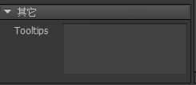

每个舞台中的组成元素我们称之为元件，元件的类型有很多，他们是：
- `基础元件` 图片、图形、动画、装载器、文本、富文本、组、组件。
- `组合型元件` 标签、按钮、下拉框、滚动条、滑动条、进度条。
- `特殊元件` 列表。

在舞台上选中任意一个元件，右边的属性栏出现共同的属性设置面板有:

## 基础属性


- `名称` 设置元件的名称。运行时可以通过GetChild(名称)获得这个元件。元件允许重名。如果有重名情况出现，在工具栏会出现一个提示。

- `宽` `高` 设置元件的宽度和高度。

- `原大小` 勾选原大小可以使元件大小恢复到素材的原始大小。当素材被外部修改后，例如一张图片素材，被设计师从50x50变成100x100，如果这里勾选着原大小，则元件的宽高也自动变成100x100；如果这里没有勾选，则元件的宽高将保持50x50，图片发生缩放。

- `宽度和高度限制`：左边为最小值，右边为最大值，0表示不限制。注意：修改宽高限制不会修改当前的宽高，即使当前的宽高值不符合限制。

- `ScaleX` `ScaleY` Scale与宽高都同样可以改变元件的显示大小，他们的不同之处在于：

 1. Scale是整体直接缩放，而宽高是改变元件的包围大小。例如，一个设置了九宫格的图片，如果改变它的Scale值，九宫格不会起作用，如果改变图片的宽高，则九宫格起作用。又例如，一个组件，如果改变它的Scale值，则组件作为一个整体放大或缩小，它里面的关联关系不会发生作用；如果改变组件的宽高，则只是组件的矩形范围增大或缩小，他里面的内容并不会自动增大或缩小，要依靠关联功能进行调整。

 2. 关联系统只对元件的宽高有效，不计入Scale的影响。

- `倾斜X` `倾斜Y` 设置元件的倾斜值。 

- `轴心X` `轴心Y` 旋转、缩放、倾斜这些变换时的轴心点。取值范围是0~1。例如X=0.5，Y=0.5表示中心位置。点击右边的小三角形可以快速设置一些常用的值，比如中心，左下角，右下角等。

- `同时作为锚点` 勾选这个选项后，元件的原点位置将设置为轴心所在的位置。默认情况下，每个元件的(0,0)都是在左上角；勾选了轴心同时作为锚点后，则元件的(0,0)在轴心的位置。注意，关联系统是不计入这个选项的影响的，所以勾选了锚点后的元件，再使用宽高类的关联，可能表现不正常。

- `透明度` 设置元件的透明度。0表示全透明，100表示全不透明。

- `旋转` 设置元件的旋转角度，单位是度（degree）。正数表示顺时针旋转，负数表示逆时针旋转。

- `不可见` 使元件处于不可见状态。在编辑状态下，即使勾选了，元件依然是可见的，只有预览状态和运行状态，才生效。

- `变灰` 使元件呈现一个灰度的效果。默认情况下，FairyGUI会使用一个颜色滤镜为其生成灰度效果。但对于组件，除了使用颜色滤镜使其整体改变灰度，还可以自定义效果。例如，一个按钮组件，由底图和上面的图片文字组成。左边是正常状态，中间是设置了“变灰”后的效果。如果我们只是希望处于变灰状态时，只要图片文字变灰，不希望底图变灰，那么可以像右图那样，在组件里定义一个名称为“grayed”的控制器，由这个控制器去控制具体变灰的状态。定义了这个名称的控制器后，默认的整体变灰效果消失。


- `不可触摸` 使元件处于不可交互的状态。鼠标点击和触摸屏触摸都不会有任何事件产生。注意：图片、普通文本（不包括输入文本和富文本）、动画是永远不可触摸的。如果要对他们侦听点击事件，请转换为组件，或者使用装载器(GLoader)。

## 效果属性


- `BlendMode` 这个提供了一部分的混合选项设置。对于Unity平台，对图片、动画、文字，你可以放心地修改它们的BlendMode。但对于组件，请谨慎使用。组件的BlendMode需要使用到FairyGUI提供的PaintMode技术，目标组件会转化为RenderTexture，再使用混合选项。这里面会有一定的内存消耗。但实现细节无需开发者介入。

Unity的Blend效果与编辑器中的预览可能会有差别。开发者可以通过使用以下代码重定义混合效果。注意：设置了特别BlendMode的显示对象无法与其他显示对象合并Draw Call。

```csharp
    BlendModeUtils.Override(BlendMode.Add,
        UnityEngine.Rendering.BlendMode.XX, UnityEngine.Rendering.BlendMode.XX);
```

- `滤镜` 目前编辑器支持两种滤镜的定义，颜色滤镜和模糊滤镜。对于H5类平台，请谨慎使用滤镜，因为会带来一定的消耗；对于Unity平台，你可以放心地对图片、动画、装载器使用颜色滤镜，这几乎不会带来额外消耗，但对于其他类型的元件，例如组件，请谨慎使用。组件的滤镜需要使用到FairyGUI提供的PaintMode技术，目标组件会转化为RenderTexture，再使用滤镜。这里面会有一定的内存消耗。但实现细节无需开发者介入。

注意：设置了滤镜的显示对象无法与其他显示对象合并Draw Call。

**Unity版本须知**

对组件使用BlendMode或者滤镜会需要用到捕获UI成纹理的功能，所以需要定义VUI、Hidden VUI这两个Layer，否则会出现警告。这两个Layer可以随便定义到没使用的层序号，但要注意所有相机的Culling Mask都**不选择**这两个层。另外，运行时场景里会自动出现Capture Camera对象，这是正常的，不需要理会。

## TIPS属性



当鼠标移到元件范围内时，显示这里可以定义的文本。用户需要提供一个组件作为显示。这个组件一般扩展为标签，以便底层将TIPS文本设置到“标题”中。打开主菜单“文件”->“项目设置”，然后在弹出的对话框里选择“预览设置”，右边面板会出现一个“TIPS组件”的设置，将你制作好的标签组件拖入即可。这里的设置仅适用于编辑器预览，运行时需要用代码再次设置，例如：

```csharp
    UIConfig.tooltipsWin = "ui://包名/组件名";
```

## GObject

- `设置坐标` SetXY或者单独设置x、y。

- `设置大小` SetSize或者单独设置width、height。SetSize还可以带第三个参数：

```csharp
   //忽略轴心的影响，即在设置了轴心的情况下，改变大小也不会同时改变坐标。
   aObject.SetSize(100,100,true);
```

- `设置大小限制` minWidth、maxWidth、minHeight、maxHeight。

- `设置Scale` SetScale或者单独设置scaleX、scaleY。

- `设置轴心` SetPivot。

```csharp
    aObject.SetPivot(0.5f, 0.5f); //设置轴心
    aObject.SetPivot(0.5f, 0.5f, true); //设置轴心，并同时作为锚点
```

- `设置可见` visible = true/false。在FariyGUI里，对象的显示和隐藏是通过直接从底层的舞台上移除实现的，不会影响FairyGUI的显示列表，但会影响底层的显示列表，也就是addToStage和removeFromStage事件是会触发的。

- `设置交互` touchable = true/false。

- `设置变灰` grayed = true/false。

- `设置激活` enabled = true/false。 元件的激活状态其实是由变灰+不可触摸共同组成。
 
```csharp
    //等同于调用GObject.grayed = true + GObject.touchable = false
    aObject.enabled = false; 
```

- `设置旋转` rotation。Unity版本还支持rotationX和rotationY。2D UI由正交相机渲染，设置rotationX或rotationY可以有旋转效果，但无透视效果。FairyGUI提供了透视模拟的功能。例如：

  ```csharp
    //设置对象实用透视模拟
    aObject.displayObject.perspective = true;
    //可以设置相机距离
    aObject.displayObject.focalLength = 2000;

    //此时旋转X轴或Y轴可以有透视效果。
    aObject.rotaionX = 30;
  ```

- `获得原生对象` displayObject。例如：

  ```csharp
    //获取原生对象
    DisplayObject displayObject = aObject.displayObject;

    //Unity版本获取GameObject
    GameObject go = displayObject.gameObject;
  ```

- `销毁` Dispose。销毁对象，当对象不再使用可以调用它。注意：纹理、声音等这些公共资源是由UIPackage管理的，销毁对象不会回收这些资源。如果要回收这些资源，应该使用UIPackage.RemovePackage。

- `resourceURL` 对象在资源库中的URL地址。只有图片、动画、组件这些有链接资源的对象才能获得这个URL值。可以用这个URL比较两个组件对象是不是由同一个组件资源构建的。URL是内部编码格式，不可读，如果要获得资源名称，可以使用下面的方法：

  ```csharp
    //对象在资源库中的名称
    Debug.Log(aObject.packageItem.name);

    //根据URL获得资源名称
    Debug.Log(UIPackage.GetItemByURL(resourceURL).name);
  ```
