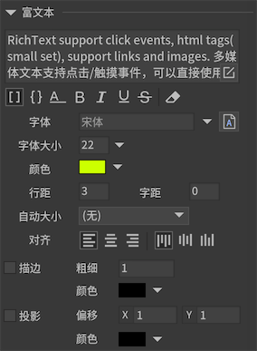

富文本与普通文本的区别在于：

- 普通文本不支持交互，鼠标/触摸感应是关闭的；富文本支持。
- 普通文本不支持链接和图文混排；富文本支持。
- 普通文本不支持HTML语法（但可以使用UBB实现不同样式）；富文本支持。

点击主工具栏中的按钮，生成一个富文本。

## 实例属性



-  设置文本支持UBB语法。使用UBB语法可以使单个文本包含多种样式，例如字体大小，颜色等。请参考[UBB语法](text.html#UBB语法)。

-  选中后，文本可以使用{count=100}这样的语法表达一个文本参数。请参考[文本模板](text.html#文本模板)。

-  设置文本为单行。单行文本不会自动换行，换行符也被忽略。

-  设置文本为粗体。

-  设置文本为斜体。

-  设置文本为下划线。

-  设置文本为删除线。注意，只有部分引擎支持。

-  表示文本只用作编辑器预览用途，发布时将会自动清除。

- `文本` 设置文本内容。富文本可直接使用[HTML语法](#HTML语法)。当需要换行时，在编辑器里可以**直接按回车**，或者使用html标签“&lt;br/&gt;”亦可。代码赋值需要换行可以用“\n”。某些引擎，例如LayaAir，可能不支持回车符换行，可以使用&lt;br/&gt;试试。

- `字体` 设置文字使用的字体。如果留空，表示使用全局设置字体（这时全局字体名称将以淡灰色显示）。详细请参考[字体](font.html)。

- `字体大小` 设置文字使用的字号。**如果使用的是位图字体，你需要对位图字体设置“允许动态改变字号”，这里的选项才有效。**

- `颜色` 设置文字颜色。**如果使用的是位图字体，你需要对位图字体设置“允许动态改变颜色”，这里的选项才有效。**

- `行距` 每行的像素间距。

- `字距` 每个字符的像素间距。*（目前H5类引擎均不支持）*

- `自动大小` 
  - `自动宽度和高度` 文本不会自动换行，宽度和高度都增长到容纳全部文本。
  - `自动高度` 文本使用固定宽度排版，到达宽度后自动换行，高度增长到容纳全部文本。
  - `自动收缩` 文本使用固定宽度排版，到达宽度后文本自动缩小，使所有文本依然全部显示。如果内容宽度小于文本宽度，则不做任何处理。
  - `无` 文本使用固定宽度和高度排版，不会自动换行。

- `对齐` 设置文本的对齐。

- `描边` 设置文本的描边效果。描边粗细数值不能过大，否则效果会比较奇怪。描边在各个引擎实现的方式不同，效果也不同，编辑器的效果也仅供参考。

- `投影` 设置文本的投影效果。投影效果可以看做是简化的描边效果，描边是所有方向，投影只有一个方向。投影和描边共用一个颜色设置。

## GRichTextField

富文本支持动态创建，例如：

```csharp
    GRichTextField aRichTextField = new GRichTextField();
    aRichTextField.SetSize(100,100);
    aRichTextField.text = "<a href='xxx'>Hello World</a>";
```

侦听富文本中链接点击的方法是（这个事件是冒泡的，也就是你可以不在富文本上侦听，在它的父元件或者祖父元件上侦听都是可以的）：

```csharp
    //Unity/Cry/MonoGame, EventContext里的data就是href值。
    aRichTextField.onClickLink.Add(onClickLink);

    //AS3/Egret，TextEvent.text就是href值。
    aRichTextField.addEventListener(TextEvent.LINK, onClickLink);

    //Egret，TextEvent.text就是href值。
    aRichTextField.addEventListener(TextEvent.LINK, this.onClickLink, this);

    //Laya, onClickLink的参数就是href值。
    aRichTextField.on(laya.events.Event.LINK,this,this.onClickLink);

    //Cocos2dx，EventContext.getDataValue().asString()就是href的值。
    aRichTextField->addEventListener(UIEventType::ClickLink, CC_CALLBACK_1(AClass::onClickLink, this));

    //CocosCreator，onClickLink的第一个参数就是href值，可选的第二个参数是fgui.Event
    aRichTextField.on(fgui.Event.LINK, this.onClickLink, this);    
```

富文本最重要的功能是支持HTML解析和渲染。普通的文本样式标签，例如`FONT`、`B`、`I`、`U`这些一般都能很好的支持。其他一些对象标签，例如`A`、`IMG`等在各个引擎中支持的力度有所不同：

- `AS3/Starling` 支持`A`标签和`IMG`标签，支持混排UI库里的图片/动画和外部图片。支持定制超级链接的样式：

    ```csharp
        aRichTextField.ALinkFormat = new TextFormat(...);
        aRichTextField.AHoverFormat = new TextFormat(...);
    ```

- `Egret` 支持`A`标签。不支持图文混排。

- `Laya` 支持`A`标签和`IMG`标签，只支持混排外部图片，**不支持UI库里的图片和动画**。Laya版本的GRichTextField的实质是包装了Laya的HTMLDivElement，可以通过以下方式访问：

    ```csharp
        var div:HtmlDivElement = aRichTextField.div;
    ```

- `Unity` 支持`A`、`IMG`、`INPUT`、`SELECT`，`P`等。请参考[这里](#HTML语法)

- `Cocos Creator` 支持 `A`、`IMG`。支持包里的和外部的图片，但不支持动画（动画显示成单帧）。Creator版本的GRichTextField的实质是包装了cc.RichText。

## HTML语法

Unity/MonoGame版本对HTML解析有比较完整的支持。

- `IMG` 支持混排UI库里的图片/动画和外部(网络）图片。加载外部图片的能力可以通过[扩展Loader](loader.html#GLoader)提供。注意，img标签需要使用“/&gt;”结束，而不是“&gt;”。例如：

    ```csharp
        

        //还可以指定图片的大小
        

        //还可以用百分比指定图片的大小
        
    ```

- `A` 显示一个超级链接。例如：

    ```csharp
        <a href='xxx'>link text</a>
    ```

    支持定义超级链接的样式。如果是全局修改，可以使用HtmlParseOptions的静态属性，例如：

    ```csharp
        //注意：全局设置应该在创建富文本之前调用。
        //设置整个项目中所有链接是否带下划线
        HtmlParseOptions.DefaultLinkUnderline = false;

        //设置超级链接的颜色
        HtmlParseOptions.DefaultLinkColor = ...;
        HtmlParseOptions.DefaultLinkBgColor = ...;
        HtmlParseOptions.DefaultLinkHoverBgColor = ...;
    ```

    如果你只想定义单个富文本的链接样式，那么可以这样：

    ```csharp
        HtmlParseOptions options = aRichTextField.richTextField.htmlParseOptions;
        options.linkUnderline = false;
        options.linkColor = ...;
        options.linkBgColor = ...;
        options.linkHoverBgColor = ...;
    ```

    如果同一个文本内的各个链接都需要不同颜色，那么在链接标签外围用颜色标签包住就行了。

- `INPUT` 支持显示以下语法：

    ```csharp
        //显示一个按钮
        <input type='button' value='标题'/>

        //显示一个输入框
        <input type='text' value='文本内容'/>
    ```

    如果需要显示按钮，需要先定义按钮对应的资源，否则无法显示。例如：

    ```csharp
        HtmlButton.resource = "ui://包名/按钮名";
    ```

    对于输入框，可以定义输入框的边框颜色和边框大小，例如：

    ```csharp
        HtmlInput.defaultBorderSize = 2;
        HtmlInput.defaultBorderColor = ...;
    ```

- `SELECT` 是使用该标签可以显示一个下拉选择框。例如：

    ```csharp
        <select name=''>
            <option value='1'>1</option>
            <option value='2'>2</option>
        </select>
    ```

    在使用下拉框前，需要先定义下拉框对应的资源，否则无法显示。例如：

    ```csharp
        HtmlSelect.resource = "ui://包名/下拉框组件名";
    ```

- `P` 例如显示一张居中的图片：

    ```csharp
        <p align='center'></p>
    ```

    默认情况下，GRichTextField将文本当做HTML片段处理，即对于空格、回车等空白字符是保留的。如果你希望当做完整的HTML处理，不保留空白，可以用以下几种方式：

  - 使用HtmlParseOptions：

  ```csharp
      HtmlParseOptions options = aRichTextField.richTextField.htmlParseOptions;
      options.ignoreWhiteSpace = true;  
  ```

  - 将文本内容使用HTML或BODY标签包裹，例如：

  ```csharp
      aRichTextField.text = "<body>text  </body>";
  ```

如果要访问HTML中的对象，可以使用以下的方式：

```csharp
    //当前文本中具有的HTML元素数量
    int cnt = aRichTextField.richTextField.htmlElementCount;

    //获得指定索引的HTML元素，0=<index<cnt
    HtmlElement element = aRichTextField.richTextField.GetHtmlElementAt(index);

    //获得指定名称的HTML元素。名称由HTML元素里的name属性指定。
    element = aRichTextField.richTextField.GetHtmlElement(elementName);

    //获得HTML元素对应的HTML对象。HTML对象的类型有HtmlImage、HtmlLink、HtmlInput等。
    IHtmlObject htmlObject = (IHtmlObject)element.htmlObject;
    if(element.type==HtmlElementType.Image)
    {
        HtmlImage image = (HtmlImage)htmlObject;
    }
```

又例如，如果要制作鼠标移到链接上显示信息的效果：

```csharp
    int cnt = richText.htmlObjectCount;
    for(int i=0;i<cnt;i++) 
    {
        IHtmlObject obj = richText.GetHtmlObjectAt(i);
        if(obj is HtmlLink) 
        {
            ((HtmlLink)obj).shape.onRollOver.Add(onLinkRollOver);
            ((HtmlLink)obj).shape.onRollOut.Add(onLinkRollOut);
        }
    }

    //你可以在RollOver和RollOut的处理里调用GRoot.inst.ShowPopup、GRoot.inst.ShowTooltips或者其他处理。
```

你也可以扩展实现自己的IHtmlObject。你需要自己实现一个IHtmlPageContext接口，然后赋值给RichTextField的htmlPageContext属性。详细可阅读源码。