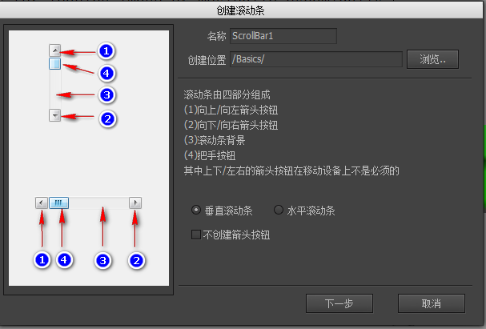
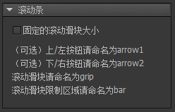

与很多UI框架使用皮肤机制定义滚动条不同，在FairyGUI中，滚动条是可以随心设计的。
[滚动容器](scrollpane.html)和滚动条是独立的，也就是说，即使没有滚动条，滚动容器也能完成滚动的功能。
注意：滚动条不能直接拖到舞台上使用，永远不要这样做。

## 创建滚动条

可以通过两种方式创建滚动条组件。

- 点击主菜单“资源”->“新建滚动条”，然后按照向导的提示一步步完成。

- 新建一个组件，然后在组件属性里选择扩展为“滚动条”。

## 设计属性

在组件编辑状态下，滚动条组件的属性面板是：

- `固定的滚动滑块大小` 一般来说，滚动条中间的滚动滑块会随着滚动区域的大小的不同而伸缩。如果滚动区域比较小，则滑块会比较大；如果滚动区域比较大，则滑块会比较小。如果你需要任何时候滑块都相同大小，那么可以勾选这个选项。勾选后，滑块的大小将保持他原来的大小。

**命名约定**

- `arrow1` 如果是水平滚动条，它表示左边的箭头按钮；如果是垂直滚动条，它表示上边的箭头按钮。它是可选的，如果你的滚动条没有箭头按钮，那么可以忽略。
- 
- `arrow2` 如果是水平滚动条，它表示右边的箭头按钮；如果是垂直滚动条，它表示下边的箭头按钮。它是可选的，如果你的滚动条没有箭头按钮，那么可以忽略。

- `grip` 表示滚动条中间的滑块按钮。

- `bar` 这个限制区域表示滚动滑块上下或者左右时滑动的范围，一般用一个空白的图形来表示就可以了，只作占位用途，没有实际渲染效果。

## 实例属性

滚动条有两种方法使用，一种是在“项目属性”->“预览设置”里设成为全局滚动条资源；另一种是在滚动容器的属性里设置。无论哪种方式，滚动条都是自动创建，然后根据滚动容器的属性调整的（参考[滚动容器](scrollpane.html)，你无法选定滚动条组件进行属性设置。

## GScrollBar

运行时滚动条组件的类型是GScrollBar，但你不需要访问GScrollBar对象。所有滚动相关的操作都通过ScrollPane完成，参考[滚动容器](scrollpane.html)。