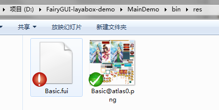

## 安装
### 使用npm下载安装
**注：目前只支持laya2.2及以上的版本**
在你的laya工程根目录下执行以下命令：
```shell
$ npm install --save fairygui-layabox
```
安装完成后会自动在你的laya工程的对应目录下生成相应文件：
```shell
...
└── your-laya-project
    ├─.laya
    ├─bin
    │   │  index.html
    │   │  ... 
    │   ├─libs
    │   │  │  laya.core.js
    │   │  │  laya.html.js
    │   │  │  ...
    │   │  └─fairygui
    │   │          fairygui.js
    │   │          rawinflate.min.js
    │   ...
    └─libs
        │  fairygui.d.ts
        │  LayaAir.d.ts
        │  ...
    ...
    
```
会在bin/index.js中自动引入相应文件：
```js
/**
 * 设置LayaNative屏幕方向，可设置以下值
 * landscape           横屏
 * portrait            竖屏
 * sensor_landscape    横屏(双方向)
 * sensor_portrait     竖屏(双方向)
 */
window.screenOrientation = "sensor_landscape";

//-----libs-begin-----
loadLib("libs/laya.core.js")
loadLib("libs/laya.ui.js")
loadLib("libs/laya.physics.js")
loadLib("libs/laya.html.js")
//-----libs-end-------
// loadLib("libs/fairygui/rawinflate.min.js");// 根据需要选择引入
loadLib("libs/fairygui/fairygui.js");
loadLib("js/bundle.js");
```
更新版本：
```shell
$ npm update fairygui-layabox
```
**注：如果你未改变laya工程对应的目录结构，自动生成才能生效**

### 手动下载安装
1. 点击[跳转](https://github.com/fairygui/FairyGUI-layabox)，使用git clone仓库或者切换到对应laya版本的分支下载并解压。


解压后1.x或2.0-2.1版本的目录结构为：
```shell
...
└── FairyGUI-layabox
    ├─bin
    │      fairygui.d.ts
    │      fairygui.js
    │      fairygui.min.js
    │
    ├─libs
    │  └─rawinflate
    │            rawinflate.d.ts
    │            rawinflate.min.js
    │
    └─source
    ...
    
```
解压后master(>=2.2.0)版本的目录结构为：
```shell
...
└── FairyGUI-layabox
    ├─demo
    └─source
        │  gulpfile.js
        │  package.json
        │  ...
        ├─bin
        │      fairygui.d.ts
        │      fairygui.js
        │      rawinflate.min.js
        │      
        ├─lib
        │      LayaAir.d.ts
        │      rawinflate.d.ts
        ├─src
    ...
    
```
2. 将fairygui.js以及依赖的rawinflate.min.js拷贝到你的laya工程根目录下的bin/libs目录（如果你在编辑器`发布设置-高级设置`面板不勾选`压缩描述文件`，那么rawinflate.min.js是不需要的）。
```shell
...
└── your-laya-project
    ├─.laya
    └─bin
        │  index.html
        │  ... 
        ├─libs
        │  │  laya.core.js
        │  │  laya.html.js
        │  │  ...
        │  └─fairygui
        │         fairygui.js
        │         rawinflate.min.js
        ├─res
    ...
    
```
3. 将fairygui.d.ts文件拷贝到你的laya工程根目录下的libs目录。
```shell
...
└── your-laya-project
    ├─.laya
    ├─bin
    └─libs
    	│  fairygui.d.ts
    	│  LayaAir.d.ts
        │  ... 
    ...
    
```
## 使用
1. 在你的laya工程里添加上述两个库的引用，注意放置的位置。

  在1.x版本在bin/index.html中添加：
```html
<body>
	<!--核心包，封装了显示对象渲染，事件，时间管理，时间轴动画，缓动，消息交互,socket，本地存储，鼠标触摸，声音，加载，颜色滤镜，位图字体等-->
	<script type="text/javascript" src="libs/laya.core.js"></script>
	<!--动画库-->
	<script type="text/javascript" src="libs/laya.ani.js"></script>
	<!--封装了html动态排版功能-->
	<script type="text/javascript" src="libs/laya.html.js"></script>
	<!--提供了制作UI的各种组件实现-->
	<script type="text/javascript" src="libs/laya.ui.js"></script>
	<!--如果勾选了不压缩，这个库不需要-->
	<script type="text/javascript" src="libs/fairygui/rawinflate.min.js"></script>
	<!--只依赖laya.core,laya.html两个模块-->
	<script type="text/javascript" src="libs/fairygui/fairygui.js"></script>
	...
</body>
```

  在2.x版本在bin/index.js中添加：
```js
/**
 * 设置LayaNative屏幕方向，可设置以下值
 * landscape           横屏
 * portrait            竖屏
 * sensor_landscape    横屏(双方向)
 * sensor_portrait     竖屏(双方向)
 */
window.screenOrientation = "sensor_landscape";

//-----libs-begin-----
loadLib("libs/laya.core.js")
loadLib("libs/laya.ui.js")
loadLib("libs/laya.physics.js")
loadLib("libs/laya.html.js")
//-----libs-end-------
// 尽量不要放在上面注释中间，因为会被ide'项目设置-类库设置'所覆盖
loadLib("libs/fairygui/rawinflate.min.js");// 如果勾选了不压缩，这个库不需要
loadLib("libs/fairygui/fairygui.js");// 只依赖laya.core,laya.html两个模块
loadLib("js/bundle.js");
```

​	**注：FairyGUI只依赖laya.core， laya.html两个模块，不需要laya.ui。**

2. 使用FairyGUI编辑器完成UI编辑。发布目录请选择Laya工程的bin/res目录（当然其他目录也是可以的）。发布后得到如下两个（或以上）文件。

  

3. 在程序启动时（或者在需要用到这些UI的适当地方）加载这两个文件，并完成初始化。

```js
    onLoaded(): void {
        Laya.stage.addChild(fgui.GRoot.inst.displayObject);
        
        fgui.UIPackage.addPackage("res/Basic");
        fgui.UIConfig.defaultFont = "宋体";
        fgui.UIConfig.verticalScrollBar = "ui://Basic/ScrollBar_VT";
        fgui.UIConfig.horizontalScrollBar = "ui://Basic/ScrollBar_HZ";
        fgui.UIConfig.popupMenu = "ui://Basic/PopupMenu";
        fgui.UIConfig.buttonSound = "ui://Basic/click";
    }
```
## 小游戏开发必读

1. 因为rawinflate这个库在小游戏平台有问题，所以直接不使用它。请使用最新编辑器，在发布对话框，全局设置里不勾选“压缩描述文件”就可以了。rawinflate这个库就不会再引用到（也不需要打包了）。
2. 小游戏不支持fui扩展名，所以在发布界面要把扩展名修改成小游戏支持的扩展名（自己查阅小游戏文档）。然后在代码里设置：
```js
    fairygui.UIConfig.packageFileExtension = "你定义的扩展名";
```
3. 在发布对话框，全局设置里勾选“使用二进制格式”。
4. AddPackage有两种方式，一种是传统的传入文件名方式，另一种是直接传入fui整个文件的内容，也就是说不管你内容是从哪里来的。两种方式可以按需选择。
5. 如果遇到加载失败，请检查laya的加载流程。因为FairyGUI不负责加载，你需要确保资源已经顺利加载了再AddPackage。