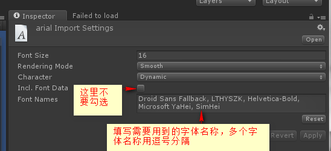
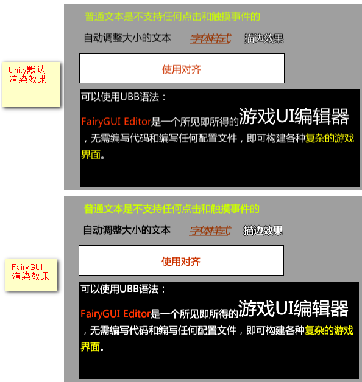

FairyGUI使用Unity的动态字体技术渲染文字。只需以下几个简单的步骤就可以完成设置：

1. 拷贝一个字体文件到项目的Resources目录或Resources/Fonts目录。字体文件可以随意使用一个，例如arial.ttf，或simhei.ttf等，这个ttf是什么字体并不影响最终显示字体的选择。

2. 在Unity中点击字体文件，在inspector中修改字体属性



注意在Font Names中填写的是字体名称，标准的字体名称可以从这里找到：[中文字体的英文名称对照表](https://wenku.baidu.com/view/598e5aec19e8b8f67c1cb915.html)。例如Droid Sans Fallback是Android平台支持中文的内置默认字体之一。多个字体用逗号隔开，Unity会使用第一个在系统中能找到的字体。

3. 设置UIConfig.defaultFont="字体文件名称"即可，注意这里使用的是文件名称，也就是说，如果放置在Resources目录的是arial.ttf，则UIConfig.defaultFont="arial"，不需要带.ttf后缀。

因为我们没有勾选Include Font Data，所以无论这个字体文件有多大，最终并不会包含在我们的发布包中，也就是说不会增大发行包的体积。Unity会在实际运行的系统中查找与Font Names匹配的第一个字体，并使用此字体进行动态渲染。但这要求玩家的运行系统环境中有你设定的字体，如果没有，实际使用的字体可能并不是你想要的效果。

从Unity5.0开始，Unity引入了新的字体管理API，也可以不放置字体文件到Resources目录，你只需要直接设置UIConfig.defaultFont="字体名称"即可，同样，多个字体名称用逗号隔开。例如：

```csharp
	UIConfig.defaultFont = "Droid Sans Fallback, LTHYSZK, Helvetica-Bold, Microsoft YaHei, SimHei";
```

4. 如果你的界面使用了多种字体，比如对单独的文字设置了字体：


这里用到了"黑体"这个名字的字体，这是与UIConfig.defaultFont设不同的字体，那么我们需要注册这种字体。方法是，首先做好上面第一步1和第2步，假如字体文件名称是HeiTi.ttf，然后：

```csharp
	FontManager.RegisterFont(FontManager.GetFont("HeiTi"), "黑体");
```

RegisterFont的第二个参数对应编辑器里使用的字体名称；第一个参数，是Unity中放入的字体文件资源。如果文件带路径，这也需要把路径填上。

要查看你定义的字体是不是生效，可以在Project视图，点击并展开字体文件，如果字体被正确使用，那么可以看到Font Texture以及Texture会有你用到的文字。


5. 当你使用部分字体的粗体效果时，你会发现粗体的效果在Unity中的显示不正确，这是因为有些字体不带粗体效果的，这时候Unity就会用拉宽来实现，就像变扁了。FairyGUI可以用额外的mesh来解决粗体的显示。方法是：

```csharp
	FontManager.GetFont(“字体路径”).customFold = true;
```

这里字体路径与UIConfig.defaultFont里设置的内容应该完全一样。

6. 某些字体，Unity渲染有粗体效果，但当设置成斜体时，粗体效果又丢失（例如雅黑）。FairyGUI在这种情况可以取消Unity默认渲染粗体的效果，改为增加额外的面渲染粗体。激活这个功能的方法是

```csharp
	FontManager.GetFont(“字体路径”).customBoldAndItalic = true;
```

如果已经设置了customBold，不需要再设置customBoldAndItalic。

7. 在实际游戏制作过程中发现在桌面平台下Unity对中文字体的渲染稍显模糊和暗淡，因此FairyGUI使用了特制的着色器解决了这个问题。以下是Unity默认的字体渲染效果和FairyGUI的字体渲染效果的比较：



可以看见经过FairyGUI的特殊处理，中文文字更清晰更亮。
只有在桌面平台下FairyGUI才会开启这种技术，移动平台永远不会开启，因为在高DPI情况下，字体默认的渲染效果已经非常漂亮。
另外，如果你不喜欢这种显示效果，或者你使用的是全英文的文字，也可以手动把这种技术关闭：

```csharp
	UIConfig.renderingTextBrighterOnDesktop = false;
```