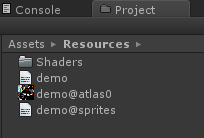
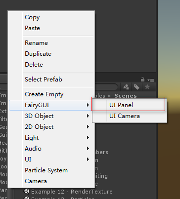
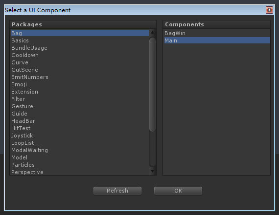
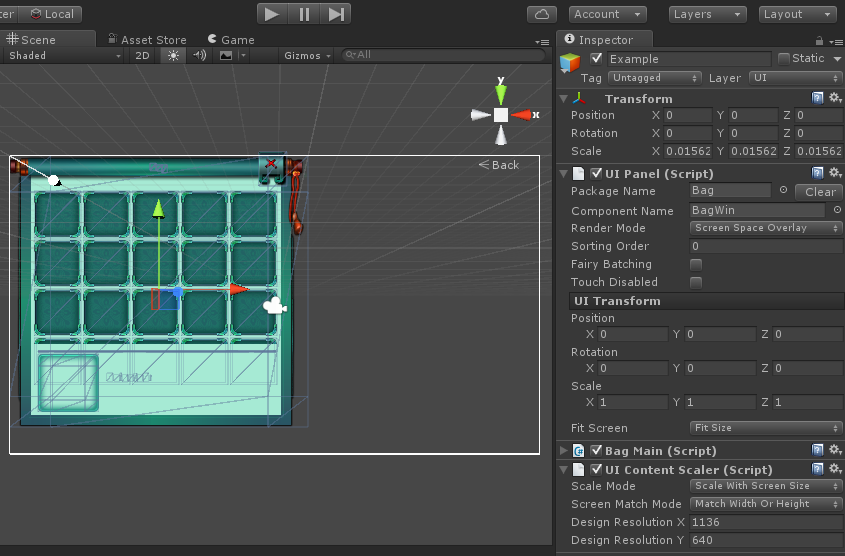
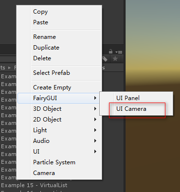
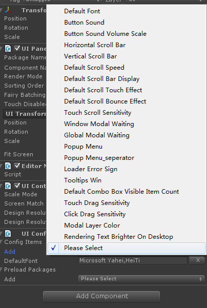

## 加载UI包

Unity项目载入UI包有以下几种方式，开发者可以根据项目需要选择其中一种或者多种方式混搭使用：

1. 将打包后的文件直接发布到Unity的Resources目录或者其子目录下，

  旧版本格式（XML）的文件列表：
  

  新版本格式（二进制）的文件列表：
  

  这种方式处理的UI包，如果使用UIPanel显示UI，不需要任何代码载入包，UIPanel会自动载入；如果是动态创建UI，则要使用代码载入包：

  ```csharp
    //demo就是发布时填写的文件名
    UIPackage.AddPackage("demo");
    
    //如果在子目录下
    UIPackage.AddPackage("路径/demo");

    //如果不放到Resources或者其子目录下，可以传入全路径，但这种方法只能在Editor里使用
    UIPackage.AddPackage("Assets/SomePath/Package1");
  ```
  AddPackage会先使用传入的路径作为key进行检测，如果这个包已经添加，则不会重复添加。

2. 将发布后的文件打包为两个AssetBundle，即定义文件和资源各打包为一个bundle(desc_bundle+res_bundle)。这样做的好处是一般UI的更新都是修改元件位置什么的，不涉及图片资源的更新，那么只需要重新打包和推送desc_bundle就行了，不需要让玩家更新通常体积比较大的res_bundle，节省流量。打包程序由开发者按照自己熟悉的方式自行实现。以demo为例，请遵循以下规则打包：
  旧版本格式（XML）：
  - demo.bytes单独打包为desc_bundle；
  - 其他资源（demo@atlas0.png等），打包到res_bundle。

  新版本格式（二进制）
  - demo_fui.bytes单独打包为desc_bundle；
  - 其他资源（demo_atlas0.png等），打包到res_bundle。

  这种方式处理的UI包，必须使用代码载入：

   ```csharp
    //desc_bundle和res_boundle的载入由开发者自行实现。
    UIPackage.AddPackage(desc_bundle, res_bundle);
  ```
  使用这种方式AddPackage，没有排重检测机制，需要你自己保证。

3. 将发布后的文件打包为一个AssetBundle。打包程序由开发者按照自己熟悉的方式自行实现。以demo为例，将demo.bytes和其他资源（demo@atlas0.png等），都放入bundle。
 
  这种方式处理的UI包，必须使用代码载入：

  ```csharp
    //bundle的载入由开发者自行实现。
    UIPackage.AddPackage(bundle);
  ```
  使用这种方式AddPackage，没有排重检测机制，需要你自己保证。

## 卸载UI包

当一个包不再使用时，可以将其卸载。

```csharp
    //这里可以使用包的id，包的名称，包的路径，均可以
    UIPackage.RemovePackage("package");
```

包卸载后，所有包里包含的贴图等资源均会被卸载，由包里创建出来的组件也无法显示正常（虽然不会报错），所以这些组件应该（或已经）被销毁。
一般不建议包进行频繁装载卸载，因为每次装载卸载必然是要消耗CPU时间（意味着耗电）和产生大量GC的。UI系统占用的内存是可以精确估算的，你可以按照包的使用频率设定哪些包是常驻内存的（建议尽量多）。

## 二进制格式的包内存管理

如果包是二进制格式的，适用于以下说明：

1. AddPackage时不会像XML格式的包那样把全部资源（贴图、声音）一次性载入，而是用到再载入。如果你需要全部载入，调用`UIPackage.LoadAllAssets`。

2. 如果UIPackage是从AssetBundle中载入的，在RemovePackage时AssetBundle才会被Unload(true)。如果你确认所有资源都已经载入了（例如调用了LoadAllAssets），也可以自行卸载AssetBundle。

3. 调用`UIPackage.UnloadAssets`可以只释放UI包的资源，而不移除包，也不需要卸载从UI包中创建的UI界面（这些界面你仍然可以调用显示，不会报错，但图片显示空白）。当包需要恢复使用时，调用`UIPackage.ReloadAssets`恢复资源，那些从这个UI包创建的UI界面能够自动恢复正常显示。如果包是从AssetBundle载入的，那么在UnloadAssets时AssetBundle会被Unload(true)，所以在ReloadAssets时，必须调用ReloadAssets一个带参数的重载并提供新的AssetBundle实例。

## UIPanel

在Unity中使用编辑器制作的界面有两种方式，第一种是使用UIPanel。

只需3步就可以使用将编辑器中制作好的界面放入到Unity的场景中。

1. 从GameObject菜单中选择FairyGUI->UIPanel：

  

2. 在Inspector里点击PackageName或者ComponentName，将弹出选择组件的窗口：

  

3. 这个窗口里列出了所有工程里能找到的UI包，选择一个包和组件，然后点击OK。（如果这里找不到你的UI包，可以尝试点击Refresh刷新）。

  可以看到，UI组件的内容显示出来了。（注意：Unity4版本目前不支持显示内容，只能显示线框）

  

如果UI包修改了，或者其他一些情况导致UIPanel显示不正常，可以使用下面的菜单刷新：


运行时，获得UIPanel的UI的方式是：

```csharp
    UIPanel panel = gameObject.GetComponent<UIPanel>();
    GComponent view = panel.ui;
```

UIPanel在GameObject销毁时（手动销毁或者过场景等）会一并销毁。

UIPane只保存了UI包的名称和组件的名称，它不对纹理或其他资源产生任何引用，也就是UI使用的资源不会包含在场景数据中。

在编辑状态下，无论UI组件引用了哪些UI包的资源，包括放置在Resources目录下的和不放置在Resources下的，都能够正确显示。**但当运行后，UIPanel只能自动载入放置在Resources目录或其子目录下的UI包，也只会载入自身所在的UI包，其他情况的UI包（例如引用到的UI包或打包到AssetBundle的UI包）不能自动载入**。你需要在UIPanel创建前使用UIPackage.AddPackage准备好这类UI包。UIPanel在Start事件或者第一次访问UIPanel.ui属性时创建UI界面，你仍然有机会在Awake里完成这些操作。

下面是UIPanel的一些属性说明：

- `Package Name` UI组件所在的包名称。注意，这里只是保存一个名称，并没有实际引用到任何UI数据。

- `Component Name` UI组件的名称。注意，这里只是保存一个名称，并没有实际引用到任何UI数据。

- `Render Mode` 有三种：
 - `Screen Space Overlay` 默认值，表示这个UI在屏幕空间显示，这时Transform的Scale将被锁定，而且不建议修改Transform中的其他内容（让他们保持为0）。如果要修改面板在屏幕上的位置，使用UI Transform（参考下面关于UI Transform的说明）。
- `Screen Space Camera` 表示这个UI在屏幕空间显示，但不使用FairyGUI默认的正交相机，而是使用指定的正交相机。
- `World Space` 表示这个UI在世界空间显示，由透视相机渲染。默认的使用场景的主相机，如果不是，那么设置Render Camera。当使用这种模式时，使用Transfrom修改UI在世界空间中的位置、缩放、旋转。但你仍然可以使用UI Transform。

注意：Render Mode只定义了FairyGUI对待这个UI的方式，通常是坐标相关的操作（如点击检测等），但和渲染无关。UI由哪个相机渲染是由GameObject的layer决定的。所以如果发现UI没有显示出来，可以检查一下GameObject的layer是否正确。例如如果是Screen Space，GameObject应该在UI层，如果是WorldSpace，则是在Default层或者其他自定义的层次。

- `Render Camera` 当Render Mode是Screen Space Camera或者World Space时可以设置。如果不设置，默认为场景的主相机。

- `Sorting Order` 调整UIPanel的显示顺序。越大的显示在越前面。

- `Fairy Batching` 是否启用Fairy Batching。关于Fairy Batching请参考[DrawCall 优化](drawcall.html)。切换这个值，可以在编辑模式下实时看到DrawCall的变化（切换后点击一下Game，Stat里显示的内容才会更新），这可以使你更加容易决定是否启用这项技术。

- `Touch Disabled` 勾选后，将关闭点击检测。当这个UI没有可交互的内容时可以勾选以提高点击检测时的性能。例如头顶血条这些类型的UI，就可以勾选。

- `UI Transform` 当Render Mode是Screen Space时可以使用这里的设置调整UI在屏幕上的位置。你仍然可以调整UIPanel的Transform改变UI的位置，但我不建议你这样做，因为Transform中的坐标位置是没有经过不同分辨率自适应的调整的。当Render Mode是World Space时，建议使用Transform设置UI的位置，你仍然可以调整UIPanel的Transform改变UI的位置，但调整的效果可能不那么直观。同时你可以使用Scene视图中下图所示的原点调整UI Transform的位置属性：


- `Fit Screen` 这里可以设置UIPanel适配屏幕。
 - `Fit Size` UI将铺满屏幕。
 - `Fit Width And Set Middle` UI将横向铺满屏幕，然后上下居中。
 - `Fit Height And Set Center` UI将纵向铺满屏幕，然后左右居中。

这里提供的选项不多，因为FairyGUI推荐的是在FairyGUI编辑器中整体设计，而不是在Unity里摆放小元件。例如如果需要不同的UI在屏幕上的各个位置布局，你应该在FairyGUI编辑器中创建一个全屏大小的组件，然后在里面放置各个子组件，再用关联控制布局；最后将这个全屏组件放置到Unity，将Fit Screen设置为Fit Size即可。错误的做法是把各个子组件放置到Unity里再布局。

- `HitTest Mode` 这里可以设置UIPanel处理鼠标或触摸事件的方式。
 - `Default` 这是默认的方式。FairyGUI会用内置的机制检测鼠标或触摸动作，不使用射线，UIPanel也不需要创建碰撞体，效率比较高。
 - `Raycast` 在这种方式下，UIPanel将自动创建碰撞体，并且使用射线方式进行点击检测。这种方式适合于UIPanel还需要和其他3D对象互动的情况。对于设置为使用Raycast进行点击测试的UIPanel，你可以使用HitTestContext.layerMask排除掉一些不关心的层。

- `Set Native Children Order` 可以在UIPanel对象下直接挂其他3D对象，例如模型、粒子等（注意设置他们的layer和UIPanel的相同），然后勾选这个选项后，就可以让这些3D对象显示在UIPanel的层次上。相当于把外部的3D对象插入到UI层次中。但这些3D对象只能显示在这个UIPanel的内容上面，不能和这个UIPanel里面的内容穿插。一般这个功能用在制作UI中使用的特效时，方便查看最终的显示结果，也可以用来观察调整模型在UI相机下的缩放倍数。

**动态创建UIPanel**

UIPanel也可以在游戏中创建，为任意游戏对象动态挂接UI界面，例如：

```csharp
    //UIPanel的生命周期将和yourGameObject保持一致。再次提醒，注意yourGameObject的layer。
    UIPanel panel = yourGameObject.AddComponent<UIPanel>();
    panel.packageName = “包名”;
    panel.componentName = “组件名”;

    //下面这是设置选项非必须
    
    //设置renderMode的方式
    panel.container.renderMode = RenderMode.WorldSpace;
    
    //设置fairyBatching的方式
    panel.container.fairyBatching = true;
    
    //设置sortingOrder的方式
    panel.SetSortingOrder(1, true);
    
    //设置hitTestMode的方式
    panel.SetHitTestMode(HitTestMode.Default);
    
    //最后，创建出UI
    panel.CreateUI();
```

**UIPanel的排序**

UIPanel在屏幕上的显示顺序是由他的sortingOrder属性决定的。sortingOrder越大，显示在越前面（越靠近屏幕）。但这里的排序是指同一个相机下的UIPanel。如果两个UIPanel由不同的相机渲染，那么他们的显示层次首先是由相机的深度（Depth）决定的，渲染相机深度较大的UIPanel一定显示在前面。

对于RenderMode为ScreenSpace的UIPanel，特别的，1000是一个特殊的层次，它表示2D UI（GRoot）的显示层次，也就是说，sortingOrder大于1000的UIPanel会显示在2D UI的上面，小于1000的都显示在2D UI的下面。

对于RenderMode为WorldSpace的UIPanel，也就是我们常说的3D UI（例如：头顶血条），如果希望通过z值来进行排序，而不是sortingOrder值，可以先将这一类UIPanel的sortingOrder设置为一个相同的值，例如100，然后调用：

```csharp
    //对sortingOrder为100的UIPanel按z进行排序，z值越小，显示在越前面。
    Stage.inst.SortWorldSpacePanelsByZOrder(100);
```

这个方法有一个List.Sort的排序消耗，不建议每帧调用，可以隔一段时间，或者在对象位置改变后才调用。

**关于HUD**

UIPanel可以用来制作头顶血条。要注意的是：
1. 放在3D对象上的UIPanel是无法和其他UIPanel进行DrawCall合并的，因此如果同屏人物很多，DC就很高。这个无法避免。如果一定要合并DC，那改用2D UI，把这些HUD对象都放到同一层里，然后与3D对象同步位置。至于近大远小之类的，要不自己按距离算scale，要不就别管了。EmitNumbers这个Demo就演示了怎样用2D UI和3D对象同步坐标。
2.  UIPanel没有自动面向屏幕的功能，自行挂脚本实现，使用LookAt一般就可以。

## 动态创建UI

在很多情况下，你并不需要将UI界面放到场景中。另外一种常用的创建UI对象的方式是：

```csharp
    GComponent view = UIPackage.CreateObject(“包名”, “组件名”).asCom;
    
    //以下几种方式都可以将view显示出来：
    
    //1，直接加到GRoot显示出来
    GRoot.inst.AddChild(view);
    
    //2，使用窗口方式显示
    aWindow.contentPane = view;
    aWindow.Show();
    
    //3，加到其他组件里
    aComponnent.AddChild(view);
```

如果界面内容过多，创建时可能引起卡顿，FairyGUI提供了异步创建UI的方式，异步创建方式下，每帧消耗的CPU时间将受到控制，但创建时间也会比同步创建稍长一点。例如：

```csharp
    UIPackage.CreateObjectAsync("包名","组件名", MyCreateObjectCallback);

    void MyCreateObjectCallback(GObject obj)
    {
    }
```

动态创建的界面不会自动销毁，例如一个背包窗口，你并不需要在每次过场景都销毁。如果要销毁界面，需要手工调用Dispose方法，例如

```csharp
    view.Dispose();
```

**使用UIPanel和UIPackage.CreateObject的场合和注意事项**

UIPanel最常用的地方就是3D UI。他可以方便地将UI挂到任意GameObject上。当然，UIPanel在2D UI中也可以使用，他的优点是可以直接摆放在场景中，符合Unity的ECS架构。缺点是这种用法对UI管理带来很多麻烦，特别是对中大型游戏。

使用UIPackage.CreateObject可以使用代码创建任何界面，可以应用在传统的设计模式中，Lua支持也十分方便。不过必须要小心处理生成的对象的生命周期，因为它需要手动显式销毁，并且永远不要将使用CreateObject创建出来的对象挂到其他一些普通GameObject上，否则那些GameObject销毁时会一并销毁这个UI里的GameObject，但这个UI又还处于正常使用状态，就会出现空引用错误。

## Stage Camera

当添加UIPanel后，或者第一次动态创建UI时，场景里会自动新增一个“Stage Camera”。这是默认的UI相机。你也可以手动在场景里增加这个UI相机：



“Stage Camera”一般不需要修改它的属性，除了下面这个：

- `Constant Size` 是否使用固定的相机大小。默认是true。这个选项仅影响粒子效果的缩放。当取值为true时，屏幕放大或缩小，粒子效果也会随着放大和缩小，这适用于手机游戏；当取值为false时，屏幕放大或缩小，粒子效果不会随着放大和缩小，这适用于PC游戏。

## UIContentScaler

UIContentScaler组件是用来设置适配的。在启动场景里任何一个GameObject挂上UIContentScaler组件即可。并不需要每个场景都挂。
**使用UIContentScaler和使用GRoot.inst.setContentScaleFactor的效果是完全一样的，选择其中一种方式设置适配即可。**


- `Scale Mode` 缩放模式。
 - `Constant Pixel Size` 不进行缩放。UI按1：1呈现。
 - `Scale With Screen Size` 根据屏幕大小进行缩放。
 - `Constant Physical Size` 暂不支持。
- `Screen Match Mode` 适配模式。参考上面API的说明。
- `Design Resolution X` `Design Resolution Y` 涉及分辨率的宽和高。
- `Ignore Orientation` 通常我们设置一个设计分辨率时，FairyGUI会自动根据横竖屏设置调整设计分辨率的屏幕方向，以保证屏幕在旋转时全局缩放系数保证不变。如果你是设计PC上的程序，可能这个特性不是你需要的，那么可以勾选此选项关闭这个功能。

## UIConfig

UIConfig组件用于设置一些全局的参数。使用UIConfig组件和在代码中使用UIConfig类设置全局参数效果是一样的。但有一个区别是使用代码去设置那么编辑模式就看不到正确的效果了，例如你用UIConfig.defaultFont去设置默认字体，那么UIPanel在编辑模式显示的字体效果就不对，只有运行后才对。解决方案就是使用UIConfig组件。在场景里选择任意一个对象，挂上UIConfig组件，修改相应的选项即可。

UIConfig组件还可以加载包，点击`Preload Packages`下面的Add即可。


